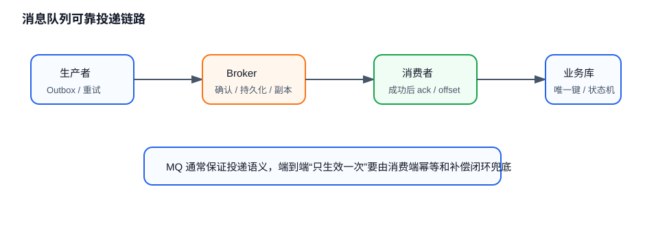

# 📨 消息队列概览

## 为什么项目中要引入消息队列？

消息队列常见价值是异步解耦、削峰填谷和可靠缓冲。比如下单后要发优惠券、通知、积分、风控，如果全部同步调用，下单链路会被最慢的下游拖住；引入消息队列后，核心链路只负责提交订单和发送事件，下游服务异步消费。

但 MQ 不是免费午餐。引入后会多出消息丢失、重复消费、顺序性、积压、事务一致性、运维复杂度等问题。面试回答最好同时说明收益和代价。

## 如何保证一条消息尽量不丢？

可靠投递要拆成三段看。

1. 生产者到 Broker：生产者开启确认机制，失败重试，并记录本地发送状态。
2. Broker 存储：队列、交换机、主题、消息本身需要持久化，多副本场景要等待足够副本确认。
3. Broker 到消费者：消费者处理成功后再提交 offset 或 ack，失败时重试或进入死信队列。

工程上还要有兜底：业务表和消息表对账、定时补偿、幂等消费、监控告警。只说“开启持久化”是不完整的，因为生产端确认、消费者 ack 和补偿链路同样关键。

## 如何处理重复消费？

多数消息队列更容易做到至少一次投递，而不是天然严格只投一次。因此消费者必须做幂等。

常见幂等方案包括业务唯一键、去重表、Redis `SETNX`、数据库唯一索引、状态机流转校验。例如订单支付成功消息可以用支付单号做唯一键，已经处理过就直接返回成功。

幂等的关键是把“是否处理过”和“业务结果写入”放在同一个可靠边界里。只在内存里记一份已消费集合，服务重启后就会失效。

## 消息积压如何排查？

消息积压通常要从生产、Broker、消费三侧排查。

- **生产侧** ：是否突增流量、重复发送、限流失效。
- **Broker 侧** ：磁盘、网络、分区或队列热点、单分区顺序消费拖慢。
- **消费侧** ：消费线程数不足、单条处理太慢、下游数据库或接口瓶颈、失败消息反复重试。

治理方式包括临时扩容消费者、增加分区或队列、批量消费、优化下游写入、隔离慢消息、把异常消息转入死信队列。对严格顺序消费的队列要小心，盲目扩容消费者不一定有效。

## MQ 如何选型？

选型要看业务主要矛盾。

- Kafka 适合高吞吐日志流、行为数据、事件流处理和可回放场景。
- RabbitMQ 适合传统业务消息、路由灵活、确认语义清晰的场景。
- RocketMQ 适合电商交易、事务消息、延迟消息、顺序消息等业务语义较强的场景。

面试中不建议只背性能排名。更好的回答是：吞吐、延迟、顺序性、事务语义、运维成本、生态、团队熟悉度一起看。
