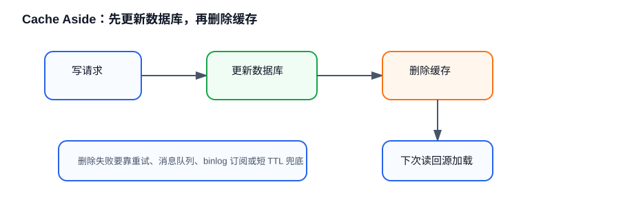

<style>
body {
  position: relative;
}

body::before {
  --size: 35px;
  --line: color-mix(in hsl, canvasText, transparent 60%);
  content: '';
  height: 100vh;
  width: 100%;
  position: absolute;
  background: linear-gradient(
        90deg,
        var(--line) 1px,
        transparent 1px var(--size)
      )
      50% 50% / var(--size) var(--size),
    linear-gradient(var(--line) 1px, transparent 1px var(--size)) 50% 50% /
      var(--size) var(--size);
  -webkit-mask: linear-gradient(-20deg, transparent 30%, white 80%);
          mask: linear-gradient(-20deg, transparent 30%, white 80%);
  top: 0;
  transform-style: flat;
  pointer-events: none;
  z-index: -1;
}

@media (max-width: 768px) {
  body::before {
    display: none;
  }
}
</style>


# 🟡 应用

## 什么是 bigkey？会带来哪些问题？

bigkey 指单个 key 对应的 value 过大，或者集合类型包含过多元素。它不只占内存，还会放大 Redis 单线程处理时间。

常见危害包括网络传输变慢、删除阻塞、持久化和主从复制压力增大、Cluster 槽迁移困难。比如一个包含几十万个元素的 List，一次 `LRANGE 0 -1` 会让事件循环长时间处理该请求，影响其他请求延迟。

治理方式包括拆分 key、限制集合元素数量、分页读取、用 `UNLINK` 异步删除、扫描时用 `SCAN` 系列命令分批处理，并在接入层限制大范围查询。

## 什么是 hotkey？如何治理？

hotkey 指某个 key 被极高频访问，导致单个 Redis 节点 CPU、网络或连接数成为瓶颈。它在秒杀商品、热点新闻、全局配置等场景很常见。

治理方式可以分层处理。

- **本地缓存** ：在应用进程内缓存短 TTL 热点数据，减少 Redis 请求。
- **副本读扩展** ：读多写少场景可让多个副本分担读流量。
- **key 拆分** ：把一个热点 key 拆成多个冗余 key，客户端随机读。
- **限流降级** ：热点突发时保护 Redis 和后端数据库。

hotkey 难点在发现。可以结合 Redis 监控、客户端埋点、代理层统计、`--hotkeys` 采样等方式定位。

## Cache Aside 为什么通常是先更新数据库再删除缓存？



Cache Aside 模式下，读请求先读缓存，未命中再读数据库并写回缓存；写请求通常先更新数据库，再删除缓存。

如果先删除缓存再更新数据库，期间有读请求发现缓存为空，可能读取旧数据库值并写回缓存，随后写请求才提交新值，缓存就会长期保留旧值。先更新数据库再删除缓存，可以把不一致窗口缩短到“数据库提交后、缓存删除前”的短时间。

即便如此，它也不是强一致方案。删除缓存失败、主从延迟、并发读写都可能造成短暂不一致，所以需要重试删除、消息队列补偿、binlog 订阅或短 TTL 兜底。

## 延迟双删能彻底保证缓存一致性吗？

不能。延迟双删是在更新数据库前后各删除一次缓存，第二次删除延迟一段时间，目的是清掉并发读请求可能写回的旧缓存。

它能降低不一致概率，但延迟时间很难精确选择：太短覆盖不了慢查询和主从延迟，太长会增加缓存空窗和数据库压力。更稳妥的做法是结合删除重试、消息队列、binlog 订阅、幂等消费和 TTL 兜底。

面试中可以总结：延迟双删是工程补偿手段，不是严格一致性协议。

## Redis 分布式锁要注意哪些问题？

最基础的单实例锁可以用 `SET key value NX PX ttl`，释放时用 Lua 脚本先校验 value 再删除，避免误删其他客户端的锁。

但它仍有风险：业务执行超过 TTL 会导致锁过期，其他客户端拿到锁后出现并发执行；主从异步复制时，主节点加锁后宕机，从节点未复制到锁就被提升，也可能出现多个客户端同时持锁。

如果业务对互斥要求很高，需要考虑锁续期、唯一 token、fencing token、幂等校验，甚至改用数据库事务、ZooKeeper / etcd 等更适合强一致协调的组件。Redlock 可以降低单点故障风险，但也要清楚它依赖时间假设，并不等同于所有场景下的强一致锁。

## 缓存雪崩、击穿、穿透和解决办法？

### 缓存雪崩

当 **大量缓存数据在同一时间过期或者 Redis 故障宕机** 时，如果此时有大量的用户请求，都无法在 Redis 中处理，于是全部请求都直接访问数据库，从而导致数据库的压力增加，严重的会造成数据库宕机，从而形成一系列连锁反应，造成整个系统崩溃。

 **解决方法**

- **大量数据同时过期**
    - **均匀设置过期时间** ：避免将大量的数据设置成同一个过期时间
    - **互斥锁** ：当业务线程在处理用户请求时，如果发现访问的数据不在 Redis 里，就加个互斥锁，保证同一时间内只有一个请求来构建缓存。未能获取互斥锁的请求等待锁释放后重新读取缓存，或者返回空值或者默认值
    - **双 key 策略** ：使用两个 key，一个是主 key，设置过期时间，一个是备 key，不会设置过期，key 不一样，但是 value 值是一样。当业务线程访问不到主 key 的缓存数据时，就直接返回备 key 的缓存数据，然后在更新缓存的时候，同时更新主 key 和备 key 的数据
    - **后台更新缓存** ：业务线程不再负责更新缓存，缓存也不设置有效期，而是让缓存“永久有效”，并将更新缓存的工作交由后台线程定时更新

- **Redis 故障宕机**
    - **服务熔断或请求限流机制** ：启动 **服务熔断** 机制， **暂停业务应用对缓存服务的访问，直接返回错误** ，所以不用再继续访问数据库，保证数据库系统的正常运行，等到 Redis 恢复正常后，再允许业务应用访问缓存服务。服务熔断机制是保护数据库的正常允许，但是暂停了业务应用访问缓存服系统，全部业务都无法正常工作。也可以启用 **请求限流** 机制， **只将少部分请求发送到数据库进行处理，再多的请求就在入口直接拒绝服务**
    - **构建高可靠集群** ：通过 **主从节点的方式构建 Redis 缓存高可靠集群** 。如果 Redis 缓存的主节点故障宕机，从节点可以切换成为主节点，继续提供缓存服务，避免了由于 Redis 故障宕机而导致的缓存雪崩问题

### 缓存击穿

如果缓存中的 **某个热点数据过期** 了，此时大量的请求访问了该热点数据，就无法从缓存中读取，直接访问数据库，数据库很容易就被高并发的请求冲垮。

 **解决方案** ：

- **互斥锁方案** ：保证同一时间只有一个业务线程更新缓存，未能获取互斥锁的请求，要么等待锁释放后重新读取缓存，要么就返回空值或者默认值
- **不给热点数据设置过期时间** ：由后台异步更新缓存，或者在热点数据准备要过期前，提前通知后台线程更新缓存以及重新设置过期时间

### 缓存穿透

当用户访问的数据， **既不在缓存中，也不在数据库中** ，导致请求在访问缓存时，发现缓存缺失，再去访问数据库时，发现数据库中也没有要访问的数据，没办法构建缓存数据，来服务后续的请求。那么当有大量这样的请求到来时，数据库的压力骤增，这就是 **缓存穿透** 的问题。

 **解决方案**

- **非法请求的限制** ：当有大量恶意请求访问不存在的数据的时候会发生缓存穿透，可以在 API 入口处判断求请求参数是否合理，请求参数是否含有非法值、请求字段是否存在，如果判断出是恶意请求就直接返回错误，避免进一步访问缓存和数据库
- **缓存空值或者默认值** ：当线上业务发现缓存穿透的现象时，可以针对查询的数据，在缓存中设置一个空值或者默认值，这样后续请求就可以从缓存中读取到空值或者默认值，返回给应用，而不会继续查询数据库
- **使用布隆过滤器快速判断数据是否存在，避免通过查询数据库来判断数据是否存在** ：可以在写入数据库数据时，使用布隆过滤器做个标记，然后在用户请求到来时，业务线程确认缓存失效后，可以通过查询布隆过滤器快速判断数据是否存在，如果不存在，就不用通过查询数据库来判断数据是否存在

## 布隆过滤器是怎么工作的？

布隆过滤器由 **初始值都为 0 的位图数组** 和  **N 个哈希函数** 两部分组成。在写入数据库数据时，在布隆过滤器里做个标记，这样下次查询数据是否在数据库时，只需要查询布隆过滤器，如果查询到数据没有被标记，说明不在数据库中。

- 第一步：使用 N 个哈希函数分别对数据做哈希计算，得到 N 个哈希值
- 第二步：将第一步得到的 N 个哈希值对位图数组的长度取模，得到每个哈希值在位图数组的对应位置
- 第三步：将每个哈希值在位图数组的对应位置的值设置为 1

 **缺陷**

- 布隆过滤器由于是基于哈希函数实现查找的，会存在哈希冲突的可能性，数据可能落在相同位置，存在误判的情况。查询布隆过滤器说数据存在，并不一定证明数据库中存在这个数据，但是查询到数据不存在，数据库中一定就不存在这个数据
- 不支持一个关键字的删除，因为一个关键字的删除会牵连其他的关键字。改进方法就是 counting Bloom filter，用一个 counter 数组代替位数组，就可以支持删除了
- 对于输入的 n 个元素，要确定数组 m 大小和 hash 函数的个数，hash 函数个数  **k = (ln2)*(m/n)**  时错误率最小。在错误率不大于 E 情况下，m 至少要等于  **n\*lg(1 / E)**  才能表示 n 个元素的集合。

## 如何保证数据库和缓存的一致性？

 **Cache Aside**

- **原理** ：先从缓存中读取数据，如果没有就再去数据库里面读数据，然后把数据放回缓存中，如果缓存中可以找到数据就直接返回数据；更新数据的时候先把数据持久化到数据库，然后再让缓存失效
- **问题** ：假如有两个操作一个更新一个查询，第一个操作先更新数据库，还没来及删除数据库，查询操作可能拿到的就是旧的数据；更新操作马上让缓存失效了，所以后续的查询可以保证数据的一致性；还有的问题就是有一个是读操作没有命中缓存，然后就到数据库中取数据，此时来了一个写操作，写完数据库后，让缓存失效，然后，之前的那个读操作再把老的数据放进去，也会造成脏数据
- **可行性** ：出现上述问题的概率其实非常低，需要同时达成读缓存时缓存失效并且有并发写的操作。数据库读写要比缓存慢得多，所以读操作在写操作之前进入数据库，并且在写操作之后更新，概率比较低

 **Read/Write Through**

- **原理** ：Read/Write Through 原理是把更新数据库(Repository)的操作由缓存代理，应用认为后端是一个单一的存储，而存储自己维护自己的缓存。
- **Read Through** ：就是在查询操作中更新缓存，也就是说，当缓存失效的时候，Cache  Aside 策略是由调用方负责把数据加载入缓存，而 Read Through 则用缓存服务自己来加载，从而对调用方是透明的
- **Write Through** ：当有数据更新的时候，如果没有命中缓存，直接更新数据库，然后返回。如果命中了缓存，则更新缓存，然后再由缓存自己更新数据库(这是一个同步操作)

 **Write Behind**

- **原理** ：在更新数据的时候，只更新缓存，不更新数据库，而缓存会异步地批量更新数据库。这个设计的好处就是让数据的 I/O 操作非常快，带来的问题是，数据不是强一致性的，而且可能会丢
- **第二步失效问题** ：这种可能性极小，缓存删除只是标记一下无效的软删除，可以看作不耗时间。如果会出问题，一般程序在写数据库那里就没有完成：故意在写完数据库后，休眠很长时间再来删除缓存

 **2PC 或是 Paxos**

- **2PC 或是 Paxos**  协议保证一致性，因为 2PC 太慢，而 Paxos 太复杂

## 如何保证删除缓存操作一定能成功？

- **重试机制** ：引入消息队列，删除缓存的操作由消费者来做，删除失败的话重新去消息队列拉取相应的操作，超过一定次数没有删除成功就像业务层报错
- **订阅 BINLog ** ：订阅 binlog 日志，拿到具体要操作的数据，然后再执行缓存删除。可以让删除服务模拟自己伪装成一个 MySQL 的从节点，向 MySQL 主节点发送 dump 请求，主节点收到请求后，就会开始推送 BINLog，删除服务解析 BINLog 字节流之后，转换为便于读取的结构化数据，再进行删除

## 业务一致性要求高怎么办？

- **先更新数据库再更新缓存** ：可以先更新数据库再更新缓存，但是可能会有并发更新的缓存不一致的问题。解决办法是更新缓存前加一个分布式锁，保证同一时间只运行一个请求更新缓存，加锁后对于写入的性能就会带来影响；在更新完缓存时，给缓存加上较短的 **过期时间** ，出现缓存不一致的情况缓存的数据也会很快过期
- **延迟双删** ：采用延迟双删，先删除缓存，然后更新数据库，等待一段时间再删除缓存。保证第一个操作再睡眠之后，第二个操作完成更新缓存操作。但是具体睡眠多久其实是个 **玄学** ，很难评估出来，这个方案也只是 **尽可能** 保证一致性而已，依然也会出现缓存不一致的现象。


## 如何避免缓存失效？

- **由后台线程频繁地检测缓存是否有效** ：检测到缓存失效了马上从数据库读取数据，并更新到缓存
- **业务线程发现缓存数据失效后** ： **通过消息队列发送一条消息通知后台线程更新缓存** ，后台线程收到消息后，在更新缓存前可以判断缓存是否存在，存在就不执行更新缓存操作；不存在就读取数据库数据，并将数据加载到缓存
- **在业务刚上线的时候** ：最好提前把数据缓起来，而不是等待用户访问才来触发缓存构建，这就是所谓的 **缓存预热** ，后台更新缓存的机制刚好也适合干这个事情

## 如何实现延迟队列？

 **使用 ZSet** ，ZSet 有一个 Score 属性可以用来存储延迟执行的时间。使用 zadd score1 value1 命令，再利用 zrangebysocre 查询符合条件的所有待处理的任务，通过循环执行队列任务。

## 如何设计一个缓存策略，可以动态缓存热点数据呢？

热点数据动态缓存的策略总体思路： **通过数据最新访问时间来做排名，并过滤掉不常访问的数据，只留下经常访问的数据** 。用 zadd 方法和 zrange 方法来完成排序队列和获取前面商品。

## Redis 实现分布式锁？

使用 SETNX 命令，只有插入的 key 不存在才插入，如果 SETNX 的 key 存在就插入失败，key 插入成功代表加锁成功，否则加锁失败；解锁的过程就是将 key 删除， **保证执行操作的客户端就是加锁的客户端** ，加锁时候要设置 unique_value，解锁的时候，要先判断锁的 unique_value 是否为加锁客户端，是才将 lock_key 键删除。此外要给锁设置一个过期时间，以免客户端拿到锁后发生异常，导致锁一直无法释放，可以指定 EX/PX 参数设置过期时间。

```bash
  SET lock_key unique_value NX PX 10000
```

## 如何保证加锁和解锁过程的原子性？

使用 Lua 脚本，因为 Redis 在执行 Lua 脚本时，可以以原子性的方式执行，保证了锁释放操作的原子性。

## 使用 Redis 实现分布式锁的优点和缺点？

- **优点** ：性能高效；实现方便；避免单点故障
- **缺点** ：超时时间不好设置。如果锁的超时时间设置过长，会影响性能，如果设置的超时时间过短会保护不到共享资源。Redis 主从复制模式中的数据是异步复制的，导致分布式锁的不可靠性。如果在 Redis 主节点获取到锁后，在没有同步到其他节点时，Redis 主节点宕机了，此时新的 Redis 主节点依然可以获取锁，所以多个应用服务就可以同时获取到锁


## 如何为分布式锁设置合理的超时时间？

可以基于续约的方式设置超时时间：先给锁设置一个超时时间，然后启动一个守护线程，让守护线程在一段时间后，重新设置这个锁的超时时间。实现方式就是：写一个守护线程，然后去判断锁的情况，当锁快失效的时候，再次进行续约加锁，当主线程执行完成后，销毁续约锁即可，不过这种方式实现起来相对复杂。

## Redis 解决集群情况下分布式锁的可靠性？

分布式锁算法 Redlock(红锁)。基于 **多个 Redis 节点** 的分布式锁，即使有节点发生了故障，锁变量仍然是存在的，客户端还是可以完成锁操作。官方推荐是至少部署 5 个 Redis 节点，而且都是主节点，它们之间没有任何关系，都是一个个孤立的节点。

 **基本思路** ： **是让客户端和多个独立的 Redis 节点依次请求申请加锁，如果客户端能够和半数以上的节点成功地完成加锁操作，那么就认为，客户端成功地获得分布式锁，否则加锁失败** 。即使有某个 Redis 节点发生故障，锁的数据在其他节点上也有保存，客户端仍然可以正常地进行锁操作，锁的数据也不会丢失。

Redlock 算法加锁三个过程：

- **第一步** ：客户端获取当前时间(t1)
- **第二步** ：客户端按顺序依次向 N 个 Redis 节点执行加锁操作：加锁操作使用 SET NX，EX/PX 选项，以及带上客户端的唯一标识。如果某个 Redis 节点发生故障了，为了保证在这种情况下，Redlock 算法能够继续运行，需要给「加锁操作」设置一个超时时间，加锁操作的超时时间需要远远地小于锁的过期时间
- **第三步** ：一旦客户端从超过半数(大于等于 N/2+1)的 Redis 节点上成功获取到了锁，就再次获取当前时间(t2)，然后计算计算整个加锁过程的总耗时(t2 - t1)。如果  **t2 - t1 < 锁的过期时间**  认为客户端加锁成功，否则认为加锁失败

加锁成功要同时满足两个条件：有超过半数的 Redis 节点成功的获取到了锁，并且总耗时没有超过锁的有效时间，那么就是加锁成功。

加锁成功后，客户端需要重新计算这把锁的有效时间，计算的结果是「锁最初设置的过期时间」减去「客户端从大多数节点获取锁的总耗时(t2 -t 1)」。如果计算的结果已经来不及完成共享数据的操作了，可以释放锁，以免出现还没完成数据操作，锁就过期了的情况。加锁失败后，客户端向 **所有 Redis 节点发起释放锁的操作** ，执行释放锁的 Lua 脚本就可以。

## Redis 管道有什么用？

管道技术是客户端提供的一种批处理技术，用于一次处理多个 Redis 命令，从而提高整个交互的性能。使用 **管道技术可以解决多个命令执行时的网络等待** ，它是把多个命令整合到一起发送给服务器端处理之后统一返回给客户端，这样就免去了每条命令执行后都要等待的情况，从而有效地提高了程序的执行效率。

但使用管道技术也要注意避免发送的命令过大，或管道内的数据太多而导致的网络阻塞。管道技术本质上是客户端提供的功能，而非 Redis 服务器端的功能。

## Redis 如何处理大 key？

### 定义

String 类型的值大于 10 KB；Hash、List、Set、ZSet 类型的元素的个数超过 5000 个

### 影响

- **客户端超时阻塞** ：由于 Redis 执行命令是单线程处理，然后在操作大 key 时会比较耗时。客户端认为很久没有响应
- **引发网络阻塞** ：每次获取大 key 产生的网络流量较大
- **阻塞工作线程** ：如果使用 del 删除大 key 时，会阻塞工作线程，这样就没办法处理后续的命令
- **内存分布不均** ：集群模型在 slot 分片均匀情况下，会出现数据和查询倾斜情况，部分有大 key 的 Redis 节点占用内存多，QPS 也会比较大

### 处理

- 当 vaule 是 string，比较难拆分，则使用序列化、压缩算法将 key 的大小控制在合理范围内，但是序列化和反序列化都会带来更多时间上的消耗
- 当 value 是 string，压缩之后仍然是大 key，则需要进行拆分，一个大 key 分为不同的部分，记录每个部分的 key，使用 multiget 等操作实现事务读取
- 分拆成几个 key-value，存储在一个 hash 中，每个 field 代表一个具体的属性，使用 hget，hmget 来获取部分的 value，使用 hset，hmset 来更新部分属性
- 当 value 是 list/set 等集合类型时，根据预估的数据规模来进行分片，不同的元素计算后分到不同的片

## Redis 支持事务回滚吗？

 **不支持** ，Redis 提供的 DISCARD 命令只能用来主动放弃事务执行，把暂存的命令队列清空，起不到回滚的效果。因为 Redis 事务的执行时，错误通常都是编程错误造成的，这种错误通常只会出现在开发环境中，而很少会在实际的生产环境中出现，所以官方认为没有必要为 Redis 开发事务回滚功能。

