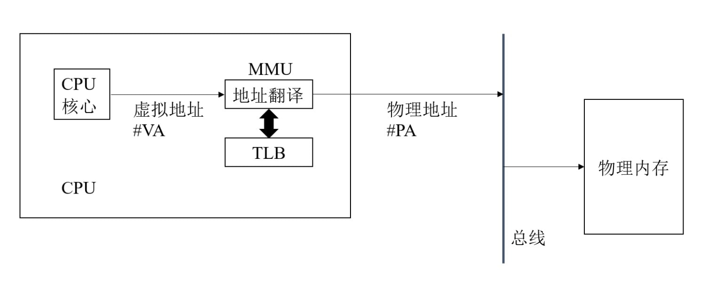
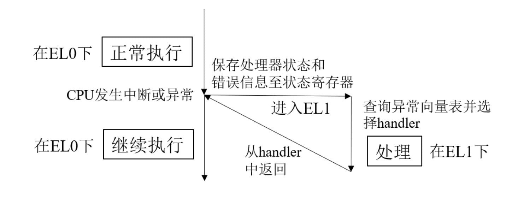

<style>
body {
  position: relative; /* 确保 body 元素的 position 属性为非静态值 */
}

body::before {
  --size: 35px; /* 调整网格单元大小 */
  --line: color-mix(in hsl, canvasText, transparent 80%); /* 调整线条透明度 */
  content: '';
  height: 100vh;
  width: 100%;
  position: absolute; /* 修改为 absolute 以使其随页面滚动 */
  background: linear-gradient(
        90deg,
        var(--line) 1px,
        transparent 1px var(--size)
      )
      50% 50% / var(--size) var(--size),
    linear-gradient(var(--line) 1px, transparent 1px var(--size)) 50% 50% /
      var(--size) var(--size);
  -webkit-mask: linear-gradient(-20deg, transparent 50%, white);
          mask: linear-gradient(-20deg, transparent 50%, white);
  top: 0;
  transform-style: flat;
  pointer-events: none;
  z-index: -1;
}

@media (max-width: 768px) {
  body::before {
    display: none; /* 在手机端隐藏网格效果 */
  }
}
</style>

# 🟡 计算机系统基础

## 讲一讲什么是操作系统？

 **操作系统(Operating System, OS)**  是管理计算机硬件和软件资源、给应用程序和用户提供底层抽象的一种系统软件。操作系统起到了计算机系统中的核心作用，它负责协调、控制和管理计算机硬件设备、系统资源和应用程序的执行。操作系统的主要功能如下：

- **硬件管理**：操作系统负责管理计算机系统的各种硬件资源，包括处理器、内存、硬盘、显示器、输入设备等。通过管理这些硬件资源，操作系统能够高效地分配和使用计算机的计算能力
- **文件管理**：操作系统提供了一个文件系统，用于组织、存储和管理用户的数据文件。文件系统允许用户创建、删除、读取和修改文件，并提供了文件保护、权限管理等功能
- **进程管理**：操作系统负责管理运行在计算机上的应用程序(进程)。它负责进程的创建、调度、终止以及进程间通信等功能。操作系统通过进程管理来保证计算机系统的稳定运行和资源的公平分配
- **内存管理**：操作系统负责管理计算机的主存储器(RAM)。内存管理包括内存分配、回收、虚拟内存管理等功能。操作系统通过内存管理来确保系统资源的高效利用
- **系统安全和保护**：操作系统负责维护系统的安全性和稳定性。它提供了各种安全机制，如用户身份验证、权限管理、防止非法访问等。操作系统通过这些机制来保护计算机系统和用户数据免受未经授权的访问
- **用户接口**：操作系统提供了用户与计算机系统之间的交互界面。这个界面可以是图形用户界面(GUI)或者命令行界面(CLI)，使用户能够方便地操作计算机系统
- **系统服务和应用程序支持**：操作系统提供了一系列的系统服务和应用程序支持，包括设备驱动程序、系统工具、应用程序接口(API)等。这些服务和支持使得应用程序能够更轻松地访问计算机的硬件资源和系统功能

## 讲一讲冯诺依曼结构？

- **存储器** 
- **中央处理器** 
- **内存** 
- **输入设备** 
- **输出设备** 

## 讲一讲外部中断与异常？

外部中断和异常是计算机系统中用于处理非正常或特殊情况的两种机制。它们都会导致处理器暂停当前正在执行的任务，并转向执行一个特定的处理程序(中断处理程序或异常处理程序)。然后在处理完这些特殊情况后，处理器会返回到被打断的任务继续执行。

- **外部中断**：外部中断是由计算机系统外部事件触发的，通常与硬件设备相关。外部中断的目的是通知处理器某个外部设备需要处理器的注意，例如设备需要传输数据、设备发生错误等。常见的外部中断来源包括：

    - **输入/输出设备**：如键盘、鼠标、硬盘等设备在数据传输完成、缓冲区已满或发生错误时发出的中断
    - **计时器**：操作系统使用计时器产生定时中断，用于实现时间片轮转等调度策略
    - **电源管理**：例如处理器需要进入低功耗模式时发出的中断

- **异常**：异常是由计算机系统内部事件触发的，通常与正在执行的程序或指令有关。异常的目的是通知处理器某个指令无法正常执行，需要采取特殊处理。常见的异常包括：

    - **算术异常**：如除以零、溢出等
    - **地址异常**：如非法内存访问、页面错误等
    - **系统调用**：程序请求操作系统提供服务时触发的异常
    - **保护异常**：如程序试图访问受保护的资源或执行非法操作时触发的异常

## CPU 地址翻译是怎样实现的？



CPU 地址翻译是计算机系统中将 **虚拟地址转换为物理地址** 的过程。地址翻译的目的是为了实现虚拟内存，让每个进程都有一致的、连续的地址空间，从而简化编程和内存管理。虚拟内存到物理内存的映射方式有两种，分页与分段，现在大部分操作系统都是分页系统。

### 地址翻译过程

在分页系统中，虚拟地址由两部分组成： **虚拟页号(Virtual Page Number, VPN)和页内偏移(Offset)**。VPN 用于标识虚拟内存中的一个页，Offset 表示在这个页中的位置。地址翻译的过程主要包括以下步骤：

1. 从虚拟地址中提取 VPN 和 Offset
2. 使用  **页表(Page Table)**  将 VPN 转换为  **物理页框号(Physical Frame Number, PFN)**。页表是操作系统维护的数据结构，用于记录虚拟页到物理页框的映射关系。每个进程都有一个独立的页表
3. 将 PFN 与 Offset 组合成物理地址

### 页表查找与地址翻译

页表查找是地址翻译过程中的关键步骤。在简单的单级页表系统中，页表是一个线性数组，使用 VPN 作为索引来查找对应的 PFN。然而，对于较大的地址空间，单级页表可能会非常庞大并且浪费内存。

为了解决这个问题， **多级页表** 被引入。在多级页表系统中，页表被划分为多级层次结构。虚拟地址被分为多个部分，每个部分用于在不同级别的页表中查找。最后一级页表包含实际的 PFN。多级页表可以有效减少内存消耗，因为只需要分配实际使用的页表空间。

### 页表缓存(TLB)

由于地址翻译过程需要多次访问内存，这会导致性能开销。为了加速地址翻译，现代处理器引入了一种叫做  **Translation Lookaside Buffer(TLB)**  的硬件缓存。TLB 缓存了最近使用过的 VPN 到 PFN 的映射关系。当处理器需要执行地址翻译时，首先在 TLB 中查找。如果找到了相应的映射，就不需要再访问页表，从而减少了内存访问次数和地址翻译的延迟。这种情况称为 TLB 命中。如果 TLB 未找到相应的映射(TLB 未命中)，则需要访问内存中的页表进行地址翻译，然后将新的映射加入 TLB。

## 介绍一下现代 CPU 指令周期与指令类型？

### 指令周期

现代 CPU 的指令周期是指  **CPU 执行一条指令所需的时间**。在处理器中，每条指令都会经过一系列阶段来完成其执行，这些阶段构成了指令执行的流水线(Pipeline)。典型的流水线包括以下阶段：

- **取指(Fetch)**：从内存中获取指令
- **解码(Decode)**：将指令转换为控制信号和操作数
- **执行(Execute)**：根据指令类型，执行相应的操作
- **访存(Memory Access)**：如果指令涉及到内存操作(如加载、存储)，则访问内存
- **写回(Write Back)**：将执行结果写回目标寄存器

现代 CPU 通常采用多级流水线设计，允许同时处理多条指令，从而提高处理器的吞吐量。

### 指令类型

CPU 支持多种不同类型的指令，这些指令可以大致分为以下几类：

- **算术指令(Arithmetic Instructions)**：执行基本的算术运算，如加法、减法、乘法和除法
- **逻辑指令(Logical Instructions)**：执行逻辑运算，如与、或、非、异或等
- **移位指令(Shift Instructions)**：对数据进行位移操作，如左移、右移等
- **控制流指令(Control Flow Instructions)**：用于改变程序执行流程，包括跳转、分支和函数调用等
- **数据传输指令(Data Transfer Instructions)**：负责在寄存器、内存和 I/O 设备之间传输数据，如加载、存储等
- **特殊指令(Special Instructions)**：用于处理特定的操作，如系统调用、同步原语、浮点运算等

不同类型的指令在执行过程中可能需要不同的时间，这取决于它们所需的流水线阶段和操作的复杂性。为了提高性能，现代 CPU 通常采用各种优化技术，如乱序执行、分支预测等。

## 讲一讲 TLB？

 **Translation Lookaside Buffer(TLB)**  是一种硬件高速缓存，用于 **加速虚拟地址到物理地址的翻译过程**。TLB 位于 CPU 内部，存储了最近使用过的虚拟地址到物理地址的映射关系。通过将常用的地址映射存储在 TLB 中，CPU 可以快速查找映射关系，而无需每次都访问内存中的页表。

### 特点

- **小容量**：与缓存相比，TLB 通常具有 **较小的容量**。由于 TLB 需要在每次地址翻译过程中进行查找，因此它需要具有较低的访问延迟。TLB 的容量通常在数十到数百条映射之间
- **关联性**：TLB  **可以是全相联、组相联或直接映射的**。在全相联 TLB 中，任何虚拟地址映射都可以放在 TLB 的任何位置。组相联 TLB 将 TLB 划分为多个组，每个组可以容纳一定数量的映射关系，虚拟地址映射根据特定策略映射到一个组中。直接映射 TLB 中，每个虚拟地址映射固定地映射到一个位置。不同关联性的 TLB 具有不同的查找速度、容量利用率和替换策略
- **替换策略**：当 TLB 满载时，需要根据某种替换策略选择一个现有的映射进行替换。常用的替换策略包括  **最近最少使用(LRU)、随机替换(Random)**  等

### 工作流程

- **查找**：当 CPU 需要进行地址翻译时，首先在 TLB 中查找相应的虚拟地址映射。如果找到了相应的映射(TLB 命中)，则不需要访问页表，直接使用 TLB 中的物理地址
- **未命中**：如果 TLB 未找到相应的映射(TLB 未命中)，则需要访问内存中的页表来进行地址翻译。地址翻译完成后，将新的映射关系添加到 TLB 中，以便后续访问

## 什么是局部性原理？

局部性原理(Locality of Reference)，又称为引用局部性，是指 **在计算机程序的执行过程中，对内存访问的一种现象**。局部性原理描述了程序在一段时间内，对内存地址的访问倾向于集中在某个较小的地址范围内。局部性原理是计算机系统中高速缓存(Cache)、TLB(Translation Lookaside Buffer)等性能优化技术的基础。

### 时间局部性

时间局部性是指 **在一段时间内，一个内存地址被多次访问的现象**。程序在执行过程中，如果某个数据或指令被访问了一次，那么在不久的将来它很可能会被再次访问。时间局部性的一个典型例子是程序中的循环结构，循环体内的指令和数据会在循环过程中被反复访问。

### 空间局部性

空间局部性是指 **在一段时间内，程序访问的内存地址倾向于集中在一定范围内的现象**。当程序访问一个内存地址时，它很可能在不久的将来访问相邻的内存地址。空间局部性的一个典型例子是程序中的数组操作，数组元素在内存中是连续存储的，访问数组时，通常会顺序地访问相邻的元素。

## 讲一讲用户态与内核态，他们之间怎么切换的？

用户态和内核态是操作系统为了保护系统资源和实现权限控制而设计的两种 **不同的 CPU 运行级别**。用户态(User Mode)是程序运行时的正常状态，而内核态(Kernel Mode)是系统在执行内核代码或响应系统调用时的特权状态。

### 用户态与内核态的区别

- **权限**：内核态具有执行所有指令和访问所有内存空间的权限，而用户态则受到限制，不能直接访问内核地址空间或执行特权指令
- **代码**：内核态主要执行操作系统的内核代码，如中断处理程序、设备驱动、文件系统等。用户态则主要执行应用程序的代码
- **资源访问**：在用户态下，程序不能直接访问受保护的系统资源，如硬件设备、中断、内核数据结构等。在内核态下，程序可以访问这些资源

### 触发用户态和内核态之间的切换的场景

- **系统调用**：当用户程序 **需要请求操作系统提供的服务** 时，会通过系统调用进入内核态。系统调用会触发一个特殊的中断，将 CPU 从用户态切换到内核态。在内核态下，操作系统会执行相应的服务例程，完成请求后，再通过中断返回指令将 CPU 切换回用户态
- **异常**：当程序执行过程中  **出现错误或异常情况(如除以零、非法指令、缺页等)**  时，CPU 会自动切换到内核态，以便操作系统能够处理这些异常
- **中断**： **外部设备(如键盘、鼠标、硬盘等)产生的中断信号** 会使 CPU 从用户态切换到内核态。操作系统会处理这些中断，执行相应的中断处理程序，然后再将 CPU 切换回用户态

### 切换过程



切换的时候会 **先保存处理器状态与错误信息至状态寄存器**，主要保存 3 个变量： **异常触发的指令地址 PC、异常的原因、当前 CPU 的栈指针 SP**。当发生用户态到内核态的切换时，CPU 会先获取异常向量表，然后根据异常的原因来调用相应的异常处理函数。异常处理完成后，会恢复应用储蓄的现场，恢复 PC 与 SP 指针，并切换回用户态。如下图所示，其中 EL0 指的是用户态，EL1 指的是内核态。

## 讲一讲 CPU 缓存？

**CPU 缓存(Cache)**  是一种位于 CPU 与主内存(RAM)之间的高速存储器，用于存储近期访问过的数据和指令。CPU 缓存的设计目的是为了减少 CPU 访问主内存所需的时间，提高处理器的性能。因为缓存的访问速度比主内存快得多，所以当 CPU 需要访问某个数据时，如果数据已经在缓存中，那么 CPU 可以更快地获取它

### 类型

- **L1 缓存**：又称一级缓存，它是最接近 CPU 的缓存层级。L1 缓存通常被分为两部分：一部分用于 **存储数据** (L1 数据缓存)，另一部分用于 **存储指令** (L1 指令缓存)。L1 缓存的容量相对较小(通常为几十 KB)，但访问 **速度最快** 
- **L2 缓存**：又称二级缓存，位于 L1 缓存之外，但仍然位于 CPU 芯片内部。L2 缓存的容量通常比 L1 缓存大，但访问 **速度略慢**。L2 缓存通常存储更多的数据和指令，以提高 CPU 的缓存命中率
- **L3 缓存**：又称三级缓存，位于 L2 缓存之外，但仍在 CPU 芯片内部。L3 缓存的容量比 L2 缓存更大，但访问 **速度略慢**。L3 缓存通常在 **多核处理器中共享**，用于在不同核之间共享数据和降低访问内存的延迟

### 组织方式

- **直接映射**：每个主内存块 **只能映射到缓存的固定位置**。这种方式实现简单，但可能导致缓存冲突
- **全相联映射**：每个主内存块 **可以映射到缓存的任何位置**。这种方式可以降低缓存冲突的可能性，但 **实现起来较为复杂**，同时搜索缓存的速度相对较慢
- **组相联映射**：这是直接映射缓存和全相联映射缓存的折衷方案。缓存被划分为多个组，每个主内存块 **可以映射到特定组中的任何位置**。这种方式在降低缓存冲突和提高查找速度方面都表现得较好

### 缓存替换策略

- **随机替换**：从缓存中随机选择一个条目进行替换。这种策略实现简单，但可能导致频繁使用的数据被替换
- **最近最少使用(LRU)**：替换缓存中最久未使用的数据或指令。这种策略依赖局部性原理，试图保留最近访问过的数据。实现起来相对复杂，但在许多情况下性能较好
- **最不经常使用(LFU)**：替换缓存中使用频率最低的数据或指令。这种策略试图保留访问次数较多的数据，但需要跟踪每个缓存条目的访问计数，实现相对复杂
- **先进先出(FIFO)**：替换缓存中最早进入的数据或指令。这种策略实现简单，但可能导致频繁使用的数据被替换

## CPU L1，L2，L3 多级缓存的基本作用？

- **L1 缓存**： L1 缓存是距离 CPU 最近的缓存层级，通常位于 CPU 内部。它的 **访问速度非常快**，但 **容量相对较小** (通常为几十 KB)。L1 缓存通常被分为两部分：L1 数据缓存(用于存储数据)和 L1 指令缓存(用于存储指令)。L1 缓存的主要作用是减少 CPU 访问数据和指令的延迟，从而提高处理速度
- **L2 缓存**： L2 缓存位于 L1 缓存之外，但仍在 CPU 芯片内部。它的访问速度 **稍慢于 L1 缓存**，但容量通常比 L1 缓存大(通常为几百 KB 至几 MB)。L2 缓存的主要作用是在 L1 缓存未命中时提供较大的数据和指令缓存空间，从而降低访问主内存的次数和延迟
- **L3 缓存**： L3 缓存位于 L2 缓存之外，但仍在 CPU 芯片内部。它的访问速度略慢于 L2 缓存，但容量比 L2 缓存更大(通常为几 MB 至几十 MB)。在多核处理器中，L3 缓存通常是所有核心共享的，用于在不同核心之间共享数据，减少访问内存的延迟。L3 缓存的主要作用是在 L1 和 L2 缓存未命中时，提供更大的数据和指令缓存空间，进一步降低访问主内存的次数和延迟

## 讲一讲 CPU 的缓存一致性？

 **CPU 缓存一致性(Cache Coherence)**  是多核处理器系统中一种关键的技术，它确保了各个核之间的数据一致性。在现代计算机系统中，为了提高性能，每个 CPU 核心都配备了一个或多个层次的缓存(如 L1、L2、L3 缓存)，用于存储临时数据。多核处理器系统中的缓存一致性问题主要涉及以下几个方面：

- **写操作的一致性**：当一个处理器对内存中的某个地址进行写操作时，需要确保其他处理器对该地址的访问能够看到这次写操作的结果。如果多个处理器同时对同一个地址进行写操作，需要确保它们的操作有一个明确的顺序
- **事务性**：多核处理器系统中的缓存一致性需要满足事务性，即对内存的操作要么完全执行，要么完全不执行。这可以确保在多个处理器之间的数据传输不会产生错误或不一致的状态
- **缓存一致性协议**：为了保持缓存一致性，需要采用一种协议来规定处理器如何操作缓存。常见的缓存一致性协议有以下几种：

    1.  **MSI 协议**： **Modified(修改)、Shared(共享) 和 Invalid(无效)**  三种状态。 MSI 协议是一种简化版的缓存一致性协议，与 MESI  协议相比，性能较低
    2.  **MESI 协议**： **Modified(修改)、Exclusive(独占)、Shared(共享) 和 Invalid(无效)**  四种状态。MESI 协议通过对缓存行设置这四种状态来维护一致性。
    3.  **MOESI 协议**：在 MESI 协议的基础上增加了一个  **Owned(拥有)**  状态，用于优化共享数据的写回操作

- **缓存一致性的实现**：实现缓存一致性需要在硬件层面进行支持。例如，多核处理器系统中通常包含一个或多个 **总线嗅探器(Bus Snooper)**，用于监控处理器之间的通信，以及一个或多个 **总线控制器(Bus Controller)**，用于控制数据在处理器之间的传输

## 讲一讲缓存一致性中的 MESI 协议？


 **MESI 协议(Modified, Exclusive, Shared, Invalid)**  是一种缓存一致性协议，用于多处理器系统中的缓存，以确保在多核处理器访问同一数据时的一致性。MESI 协议通过四种状态来跟踪缓存行(cache line)的状态，每个缓存行可以处于以下四种状态之一：

- **Modified(修改)**：缓存行中的数据已经被修改，与内存中的数据不一致。在此状态下，该处理器核心负责将数据写回主内存
- **Exclusive(独占)**：缓存行中的数据与内存中的数据一致，且此数据只在当前缓存中存在。这意味着其他处理器核心的缓存中不存在该数据
- **Shared(共享)**：缓存行中的数据与内存中的数据一致，但可能在其他处理器核心的缓存中也存在。此时，多个处理器核心都可以读取该数据
- **Invalid(无效)**：缓存行中的数据是无效的，可能是因为其他处理器核心修改了数据，或者当前处理器核心失去了对该数据的独占权限

MESI 协议通过监控处理器核心的读写操作以及跟踪其他核心的操作来实现缓存一致性。当一个处理器核心需要执行读或写操作时，它会发送请求到其他核心，以便根据其他核心的缓存状态来更新自己的缓存行状态。例如，当一个处理器核心需要修改一份共享数据时，它会向其他拥有该数据的核心发出请求，使其将缓存行状态标记为无效。这样，修改后的数据只存在于一个核心的缓存中，确保了数据一致性。

## 讲一讲伪共享问题？ 

### 概念

 **伪共享(False Sharing)**  是一个多处理器系统中的性能问题，当多个处理器核心频繁访问位于同一个缓存行(cache line)内的不同数据时，可能导致性能下降。这种情况下，虽然处理器核心访问的数据实际上并没有共享，但由于它们位于相同的缓存行内，会导致缓存一致性协议(如 MESI  协议)误认为数据是共享的，从而触发不必要的缓存同步操作。

伪共享的产生原因是 **缓存行的设计**。在处理器中，数据是以缓存行为单位进行存取的，而缓存行一般大小为 64 字节(可根据处理器不同而变化)。当两个处理器核心访问的数据恰好位于同一个缓存行内时，即使它们访问的是不同的变量，也会导致伪共享问题。

### 导致的问题

- **性能下降**：由于频繁的缓存同步操作，处理器核心需要等待数据在各个缓存间传输，从而导致性能下降
- **增加总线流量**：处理器核心之间需要通过总线进行通信，以维护缓存一致性。伪共享会导致更多的通信开销，增加总线流量

### 解决办法

- **数据对齐与填充**：通过对齐数据结构或在数据结构之间添加填充，使得不同处理器核心访问的数据位于不同的缓存行内
- **优化数据布局**：尽量使同一个缓存行内的数据是由同一个处理器核心频繁访问的，避免跨核访问
- **降低共享数据的使用**：尽量减少共享数据，或将共享数据的访问频率降低，以降低伪共享的可能性
- **使用无锁数据结构**：无锁数据结构能够减少对共享数据的争用，从而降低伪共享问题的影响

## 程序执行的基本过程？

程序执行的基本过程涉及程序从源代码到可执行程序的转换，以及在计算机系统中的实际执行。下面是一个简化的程序执行过程：

- **编写源代码**：程序员使用某种编程语言(如 C、Java 或 Python 等)编写程序的源代码。源代码是人类可读的文本形式，包含了程序的逻辑和控制结构
- **编译/解释**：

    - 对于 **编译型语言** (如 C、C++ 等)：源代码需要经过编译器将其编译成目标代码(通常是二进制文件)，称为可执行程序。这个过程包括预处理、编译、汇编和链接等步骤。
    - 对于 **解释型语言** (如 Python、JavaScript 等)：源代码通常不需要事先编译成可执行程序，而是在运行时由解释器逐行解释并执行。

- **加载**：当可执行程序准备好后，操作系统负责将其加载到内存中。这个过程涉及分配内存、加载代码和数据等
- **执行**：处理器按照程序指令顺序执行程序
- **系统调用与库函数**：程序执行过程中可能需要与操作系统或其他库进行交互。这时，程序会发起系统调用或调用库函数来完成特定任务，如文件读写、内存管理、网络通信等
- **结束**：当程序执行完毕，操作系统负责回收程序占用的资源，如内存、文件句柄等，并将程序退出状态返回给用户

## 常用的 Linux 命令？

- **find**：查找文件或目录的路径
- **pwd**：显示当前所在路径
- **ls**：列出当前目录所有子目录与文件
- **cd**：切换工作目录
- **man**：查看帮助手册
- **grep**：查找文件或其他内容里符合条件的字符串
- **chmod**：控制用户对文件的权限的命令
- **ps**：列出系统中当前运行的进程
- **kill**：向执行中进程发出信号

## Linux 页大小是多少？

Linux 操作系统中的页大小可能因系统和硬件架构而异。在许多系统上，页大小通常为  **4KB(4096字节)**。使用以下命令查看页大小：
```bash
getconf PAGE_SIZE
```

## Linux 下如何查看 CPU 荷载，正在运行的线程，某个端口对应的进程？

- **查看 CPU 荷载**：使用  **top 命令** 来查看实时的系统状态，包括 CPU 负载、内存使用情况等；使用  **uptime 命令** 查看系统运行时间和平均负载
- **查看正在运行的进程**：使用  **ps 命令** 来查看当前系统中正在运行的线程。要查看所有线程(包括其他用户的线程)，使用  **ps -eLf 命令** 
- **查看某个端口对应的进程**：可以 **使用 netstat 或 lsof 命令** 

## Linux 下如何排查 CPU 以及内存占用过多？

- **top**：使用 top 命令可以实时查看系统的资源使用情况，包括 CPU 和内存占用。在 top 界面中，进程会按照 CPU 占用率进行排序，可以观察哪些进程占用了较多的 CPU 和内存资源
- **htop**：htop 是 top 命令的一个增强版，提供了更丰富的视图和更多的交互功能。htop 会显示资源占用情况，可以使用 F 键进行排序、筛选和搜索
- **ps**：使用 ps 命令可以查看当前运行的进程。要按 CPU 或内存占用对进程进行排序
- **free**：使用 free 命令可以查看系统的内存使用情况
- **vmstat**：vmstat 命令提供有关虚拟内存、进程、CPU 活动等的报告

当找到占用大量 CPU 或内存资源的进程时，可以根据具体情况优化程序代码、调整进程优先级、限制资源使用或杀死进程。要杀死进程，可以使用  **kill 或 pkill 命令**， **kill 进程 ID**  或  **pkill 进程名称** 

## Linux 如何查看实时的滚动日志？

使用  **tail 命令** 查看实时的滚动日志。tail 命令可以显示文件的最后部分，-f 选项使命令持续输出文件的新增内容，这样就可以实时查看滚动日志。假设想查看名为 /var/log/mylogfile.log 的日志文件：

```bash
tail -f /var/log/mylogfile.log
```
当文件内容发生更改时，新的日志行将自动显示在终端上。

## traceroute 命令的原理？

traceroute 是一个网络诊断工具，用于跟踪数据包在 IP 网络中从源主机到目标主机的路径。它可以帮助识别和定位网络延迟和问题的来源。traceroute 的原理基于 IP 协议中的“生存时间”(TTL)字段。

TTL(Time to Live)是 IP 包头中的一个字段，表示数据包在网络中允许经过的最大跳数(路由器)。每当数据包经过一个路由器时，TTL 值减 1。当 TTL 值变为 0 时，路由器将丢弃该数据包，并向源主机发送一条  **ICMP “超时”(Time Exceeded)消息**。

traceroute 通过发送一系列数据包来工作，这些数据包具有逐渐增加的 TTL 值。对于每个数据包，当 TTL 值耗尽时，沿途的路由器会返回一个 ICMP “超时”消息。traceroute 通过收集这些消息来确定数据包经过的路径。

### 基本工作原理

1.  **traceroute 首先发送一个 TTL 为 1 的数据包** (通常是 ICMP Echo 请求或 UDP 数据包)到目标主机
2. 当第一个路由器收到此数据包时，它将 TTL 值减 1(变为 0)，然后丢弃该数据包，并向源主机发送一个 ICMP “超时”消息
3. traceroute 接收到 ICMP “超时”消息后， **记录发送此消息的路由器的 IP 地址和传输时间** 
4. 然后，traceroute 增加 TTL 值(比如设置为 2)，重复步骤 1-3。这次，数据包将到达第二个路由器，然后被丢弃，并返回另一个 ICMP “超时”消息
5.  **traceroute 继续逐步增加 TTL 值**，直到数据包到达目标主机或达到最大跳数限制

最后，traceroute 命令会显示从源主机到目标主机的完整路径，包括每个经过的路由器的 IP 地址、主机名(如果可用)和每个跳的往返时间。这有助于识别和排除网络问题。

## ASCII，Unicode，UTF-8 的区别？

ASCII(美国标准信息交换代码)、Unicode(统一字符编码)和 UTF-8(8 位 Unicode 转换格式)是计算机中用于表示和处理文本的不同字符编码方案。它们之间的区别如下：

- **ASCII**：ASCII 是一种基于拉丁字母表的字符编码，最初于 1963 年发布。它使用  **7 位二进制数(即 128 个可能值)**  来表示 128 个不同字符，包括大小写英文字母、数字 0-9、标点符号以及一些控制字符。ASCII 只能表示英语中的字符，无法表示其他语言的字符。随着计算机科技的发展，ASCII 已无法满足现代多语言环境的需求
- **Unicode**：为了解决 ASCII 不能表示多种语言字符的问题，Unicode 应运而生。Unicode 是一种字符集，旨在包含世界上所有语言的字符和符号。Unicode 为每个字符分配一个唯一的数字代码点，可以表示超过 110,000 个字符，包括拉丁字母、希腊字母、汉字、象形文字等。然而， **Unicode 本身不是一种编码方案**，而是为字符分配代码点的标准。为了在计算机中存储和处理这些字符，需要使用不同的编码方案，如 UTF-8、UTF-16 和 UTF-32
- **UTF-8**： **UTF-8 是 Unicode 的一种变长字节编码方案**。它 **使用 1 到 4 个字节表示一个字符**，根据字符的 Unicode 代码点进行编码。UTF-8 的优点是向后兼容 ASCII，即 ASCII 字符在 UTF-8 中的表示与原始 ASCII 编码相同。这意味着许多现有的 ASCII 文本和软件无需修改即可处理 UTF-8 编码的文本。由于其兼容性和高效的存储方式，UTF-8 已成为 Web 和许多操作系统中最常用的字符编码方案

总结：ASCII 是一种 **有限的、只能表示英语字符的编码方案**。Unicode 是一种广泛的字符集，可以 **表示世界上所有语言的字符**。UTF-8 是  **Unicode 字符集的一种编码方案**，可以高效地存储和处理 Unicode 字符，且与 ASCII 兼容。
