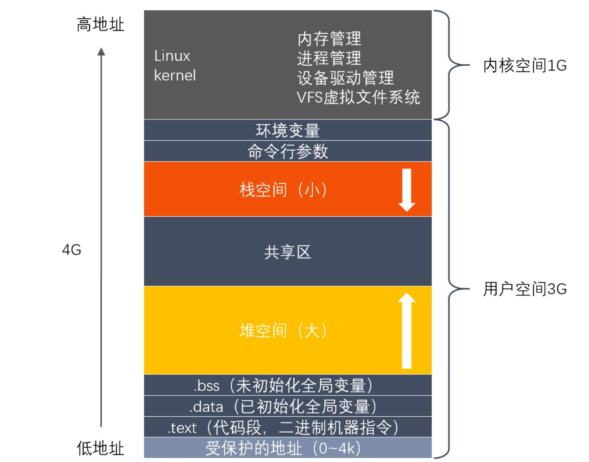

# 🔴 Memory

## 内存虚拟化是什么，这么做有什么目的？

内存虚拟化是一种将物理内存资源抽象、管理和分配的技术。它允许将计算机的物理内存划分为独立的、隔离的虚拟内存块，每个虚拟内存块都由操作系统或虚拟机管理。内存虚拟化可以在多个层次实现，如硬件层、操作系统层或应用程序层。

其主要目的有：

- **资源隔离与共享**：内存虚拟化可以在不同的进程、应用程序或虚拟机之间隔离内存资源，从而提高系统的稳定性和安全性。同时，内存虚拟化还支持灵活地共享内存资源，以实现负载均衡和资源利用率最大化
- **易用性**：内存虚拟化简化了内存管理，使得程序员无需关注物理内存的具体细节。程序员可以专注于编写代码，而操作系统和硬件负责处理内存分配、回收等问题
- **容错与恢复**：内存虚拟化有助于实现容错和故障恢复。当系统发生故障时，可以将虚拟内存的状态保存到硬盘上，然后在另一台计算机上恢复虚拟内存状态，以实现快速恢复
- **内存优化**：内存虚拟化支持一些内存优化技术，如按需分配、内存去重和内存压缩。这些技术可以提高内存资源的利用率，降低内存成本
- **进程保护**：每个进程都有自己的虚拟地址空间，这样就能防止一个进程意外或恶意地访问另一个进程的内存。这有助于提高系统的安全性和稳定性

## 逻辑地址(虚拟地址)与物理地址的区别？

逻辑地址和物理地址是用于描述内存位置的两种不同方式。它们之间的区别如下：

- **逻辑地址**： 逻辑地址也称为虚拟地址， **是由 CPU 生成的地址**。程序在执行时，它所引用的内存地址都是逻辑地址。逻辑地址是相对于每个运行的进程的，每个进程都有自己的逻辑地址空间。逻辑地址由操作系统和硬件通过内存管理单元(MMU)映射到物理地址，以访问实际的物理内存。这种映射机制使得每个进程都可以认为自己拥有连续的、独立的内存空间，而无需关心其他进程和物理内存的实际布局
- **物理地址**：物理地址是实际内存硬件中的地址，用于在物理内存(如 RAM)中定位数据。物理地址是全局唯一的，它直接表示物理内存中的位置。当程序通过逻辑地址访问内存时，内存管理单元(MMU)会将逻辑地址转换为物理地址，然后在物理内存中读取或写入数据

逻辑地址和物理地址之间的区别在于它们表示的内存位置类型和用途。逻辑地址由程序和 CPU 生成，用于表示进程内部的内存引用。物理地址表示实际内存硬件中的位置，用于在物理内存中访问数据。逻辑地址和物理地址之间的映射由操作系统和内存管理单元(MMU)完成，以实现内存虚拟化、进程隔离和资源管理等功能。

## 操作系统在对内存管理时做了什么？

操作系统负责为进程分配、管理和回收内存资源。操作系统在内存管理方面主要执行以下任务：

- **内存分配**：当一个进程需要内存空间时，操作系统负责为其分配内存。通常，操作系统会维护一个内存空闲列表或内存池，用于追踪可用的内存块。当进程申请内存时，操作系统会从这些列表或池中分配合适大小的内存块
- **地址空间管理**：操作系统为每个进程创建和管理一个虚拟地址空间。虚拟地址空间是一个连续的地址范围，用于表示进程可以访问的内存。操作系统通过内存管理单元(MMU)将虚拟地址映射到实际的物理内存地址
- **内存保护**：操作系统需要确保每个进程的内存空间不被其他进程非法访问。内存保护功能防止一个进程访问另一个进程的地址空间，从而确保系统的稳定性和安全性
- **内存回收**：当进程终止或释放内存时，操作系统负责回收已分配的内存资源。回收的内存将返回到空闲内存列表或内存池，以便后续分配给其他进程
- **页面置换**：在虚拟内存系统中，操作系统使用页面置换算法(如 LRU、FIFO 等)来管理内存中的页面。当物理内存不足以容纳新的页面时，操作系统会选择一个合适的页面将其从内存中换出，以便为新页面腾出空间
- **内存优化**：操作系统通过一些技术来优化内存使用，提高内存资源的利用率。例如，操作系统可以使用内存去重(将相同内容的多个内存页面合并为一个)，内存压缩(压缩不常用的内存页面以节省空间)和按需分配(只在需要时分配内存)等技术

## 讲一讲物理内存与虚拟内存的映射机制？

物理内存与虚拟内存的映射机制是计算机系统中实现内存虚拟化的关键技术。虚拟内存到物理内存的映射方式一般有分段和分页两种，由于分段机制内存碎片较多，常用的是分页机制。映射过程由内存管理单元(MMU)和操作系统共同完成。以下是物理内存与虚拟内存的映射机制的基本原理：

- **分页机制**： 在分页系统中，虚拟内存和物理内存都被划分为固定大小的单元，称为页(page)。虚拟页的大小与物理页相同，通常为 4KB 或更大。分页系统的主要目的是将虚拟内存中的页映射到物理内存中的页
- **页表**： 页表是一种数据结构，用于存储虚拟页到物理页的映射关系。每个进程都有自己的页表，由操作系统管理。页表中的每个条目包含一个虚拟页号和对应的物理页号。当 CPU 访问虚拟内存时，MMU 会使用页表将虚拟地址转换为物理地址
- **地址转换**： 虚拟地址通常由两部分组成：虚拟页号(VPN)和页内偏移(offset)。虚拟页号用于查找页表中相应的物理页号，而页内偏移表示在物理页中的具体位置。地址转换过程如下：
  
    - CPU 生成一个虚拟地址
    - MMU 从虚拟地址中提取虚拟页号(VPN)和页内偏移(offset)
    - MMU 使用 VPN 在页表中查找对应的物理页号(PPN)
    - MMU 将物理页号(PPN)与页内偏移(offset)组合成物理地址
    - CPU 使用物理地址访问物理内存

- **页面置换和缺页中断**：当虚拟页尚未加载到物理内存时，发生页面缺失(page fault)。在这种情况下，操作系统需要从硬盘或其他存储设备中加载所需的虚拟页，并将其映射到物理内存。为了腾出空间，操作系统可能需要选择一个已加载的页面，将其换出到硬盘。页面置换算法(如 LRU、 FIFO 等)用于决定哪个页面应该被换出
- **多级页表**：多级页表是一种用于减少页表大小的技术。在具有大量虚拟地址空间的系统中，使用单级页表可能导致浪费大量内存。多级页表通过将虚拟地址空间划分为多个层次来减小页表的大小。每个层次都有自己的页表，只有在需要时才会分配。这样可以大大减少内存开销
- **快表(TLB)**：快表，也称为转换后援缓冲(Translation Lookaside Buffer)，是一种硬件缓存，用于加速虚拟地址到物理地址的转换过程。TLB 将最近使用过的虚拟地址到物理地址的映射存储在高速缓存中，以便快速查找。当 MMU 需要转换一个虚拟地址时，它首先检查 TLB 是否包含所需的映射。如果 TLB 中存在映射，MMU 可以避免访问内存中的页表，从而加速地址转换过程
- **内存分配策略**：操作系统使用不同的内存分配策略来管理虚拟内存和物理内存之间的映射。 **按需分配(demand paging)**  是一种常用的策略，它只在进程实际访问虚拟内存时才将虚拟页加载到物理内存。 **预取(prefetching)**  是另一种策略，它根据进程的访问模式提前加载可能需要的虚拟页，以减少页面缺失的开销
- **内存共享**：内存共享是一种允许多个进程访问相同物理内存区域的技术。通过将不同进程的虚拟地址映射到同一物理页，操作系统可以实现内存共享。这种技术在共享库、进程间通信和内存去重等场景中非常有用

物理内存与虚拟内存的映射机制通过分页、页表、地址转换、多级页表、TLB、内存分配策略等技术实现。这种映射提供了内存虚拟化、进程隔离和内存优化等关键功能。

## 什么是换页机制？

**换页机制(Paging)是计算机系统中一种用于内存管理和虚拟内存实现的技术**。它将虚拟内存和物理内存分成固定大小的单元，称为“页”(Page)。换页机制的主要目的是允许将虚拟内存中的页映射到物理内存中的页，从而实现内存虚拟化、提高内存利用率和实现进程隔离。换页机制的核心概念如下：

- **页(Page)**：虚拟内存和物理内存都被划分为固定大小的单元，通常为 4KB 或更大。虚拟页和物理页的大小相同。
- **页表(Page Table)**：页表是一种数据结构，用于存储虚拟页和物理页之间的映射关系。每个进程都有自己的页表，由操作系统负责管理
- **内存管理单元(MMU)**：内存管理单元是硬件组件，负责在 CPU 访问内存时将虚拟地址转换为物理地址。MMU 使用页表完成虚拟地址到物理地址的映射
- **页面置换算法**：当物理内存中没有足够的空间容纳新的虚拟页时，操作系统需要选择一个或多个物理页将其换出以腾出空间。页面置换算法(如最近最少使用(LRU)、先进先出(FIFO)等)用于确定哪些页应该被换出
- **缺页中断(Page Fault)**：当一个进程试图访问尚未加载到物理内存的虚拟页时，会发生缺页中断。此时，操作系统需要从硬盘或其他存储设备加载所需的虚拟页，并将其映射到物理内存

换页机制通过将虚拟内存和物理内存划分为页，并使用页表和 MMU 进行地址映射，实现了内存虚拟化、内存优化和进程隔离等关键功能。此外，换页机制还允许操作系统动态地将进程的内存部分加载到物理内存，从而在有限的物理内存中运行更多的进程。

## 操作系统中的缺页中断？

### 概念

**缺页中断(Page Fault)是操作系统中的一种中断，主要发生在程序访问到了一个尚未加载到物理内存(RAM)的虚拟内存地址时**。当程序试图访问这个地址时，CPU 会触发一个缺页中断，通知操作系统需要加载相应的内存页面。缺页中断是内存管理的一部分，尤其是在虚拟内存系统中。关于缺页中断的核心概念：

- **虚拟内存**：虚拟内存是一种内存管理技术，它使得程序能够访问到比物理内存更大的地址空间。虚拟内存利用了硬盘空间来模拟更大的内存，从而使得程序能够在有限的物理内存中更加高效地运行
- **内存分页**：虚拟内存通常会被分割成固定大小的单元，称为页(Page)。物理内存同样会被分割成相同大小的单元，称为页帧(Page Frame)。操作系统负责管理虚拟内存与物理内存之间的映射关系
- **页表**：操作系统使用一种称为页表(Page Table)的数据结构来维护虚拟内存和物理内存之间的映射关系。每个运行中的进程都有自己的页表

### 过程

当程序访问一个未加载到物理内存的虚拟地址时，CPU 会触发缺页中断。这时，操作系统会执行以下操作：

1. **检查虚拟地址是否有效**，即是否存在对应的虚拟内存页。如果无效，操作系统将向程序返回一个错误，可能导致程序终止
2. 如果虚拟地址有效，操作系统会 **查找一个空闲的物理内存页帧** 来存储所需的虚拟内存页
3. 如 **果没有空闲的物理内存页帧，操作系统会选择一个当前已加载的页面进行替换**，将其写回硬盘(如果被修改过)以释放页帧
4. 操作系统从硬盘中读取所需的虚拟内存页并将其加载到新分配的物理内存页帧中
5. 更新页表，将虚拟地址映射到新分配的物理内存页帧
6. 恢复程序执行，使程序能够继续访问所需的虚拟内存地址

### 优化策略

缺页中断是一种有效地管理有限物理内存资源的方法，它可以实现内存数据按需加载，提高内存利用率。然而，缺页中断的处理过程涉及硬盘读写，相较于内存访问速度，硬盘读写速度较慢，因此缺页中断会对系统性能产生影响。为了减轻缺页中断对性能的影响，操作系统采用了以下优化策略：

- **缓存与缓冲**：操作系统通过使用缓存和缓冲区来减少硬盘访问次数。缓存可以暂存最近访问过的硬盘数据，提高数据读取速度。缓冲区可以合并多个连续的写操作，减少硬盘写入次数
- **预取**：预取是一种预测性技术，它根据程序的访问模式来预先加载可能被访问的内存页，从而减少缺页中断的发生
- **页置换算法**：为了提高内存利用效率，操作系统使用页置换算法来决定在发生缺页中断时，应该替换哪个物理内存页帧。常见的页置换算法有：最近最少使用(LRU)、最不经常使用(LFU)和时钟算法等
- **写回策略与写穿策略**： **写回策略允许操作系统在将内存页写回硬盘之前缓存修改过的数据**，减少硬盘写入次数。 **写穿策略则要求每次修改内存页时都将更改立即写回硬盘**，这可以确保数据一致性，但会增加硬盘写入次数
- **内存压缩**：内存压缩技术可以将内存中的空闲空间压缩，从而减少内存碎片，提高内存利用率

通过这些优化操作系统可以在一定程度上减轻缺页中断对系统性能的影响，实现对有限物理内存资源的高效管理。

## 换页时的抖动是什么？

### 概念

**抖动(Thrashing)是一种在操作系统中出现的现象，当系统频繁发生缺页中断并进行换页操作时，会导致系统性能急剧下降**。在抖动现象下，CPU 大部分时间都用于处理缺页中断和换页操作，而不是执行实际的应用程序。这导致系统的吞吐量和响应时间变差，从而使得系统表现出低效的运行状态。

### 原因

- **过高的内存需求**：当一个或多个运行中的进程所需的内存空间超过了可用的物理内存时，操作系统需要频繁地在物理内存和硬盘之间交换内存页面。这将导致大量的缺页中断和换页操作，从而引发抖动现象
- **不恰当的内存分配**：如果操作系统没有合理地分配内存资源给各个进程，可能会导致某些进程无法获得足够的内存空间，从而引发抖动现象
- **不合理的页置换算法**：如果操作系统采用的页置换算法不能准确地预测进程将访问哪些内存页面，可能会导致频繁的换页操作，进而引发抖动现象

### 解决方案

- **内存管理优化**：操作系统可以采用更先进的内存管理技术和页置换算法，以提高内存利用率，减少缺页中断和换页操作的频率
- **资源控制**：操作系统可以对进程进行资源控制，限制其内存使用量，防止因过高的内存需求导致的抖动现象
- **内存扩展**：增加物理内存容量可以减少换页操作的需要，从而降低抖动现象的发生概率
- **调整工作负载**：减少同时运行的进程数量，合理分配系统资源，确保每个进程都能获得足够的内存空间，以降低抖动现象的发生概率
- **使用交换空间**：在硬盘上设置交换空间(Swap Space)，可以为操作系统提供额外的虚拟内存，以缓解内存不足的问题，减轻抖动现象。但需要注意的是，交换空间使用硬盘存储，其速度较慢，因此不能完全替代物理内存

## 进程的内存分布？

进程是操作系统中一个运行中的程序实例。在操作系统中，每个进程都拥有独立的虚拟内存空间，以便存储其代码、数据和运行时所需的信息。进程的内存空间通常分为以下几个区域：

- **代码区(Text Segment)**：代码区包含了进程的可执行代码。这部分内存区域通常是只读的，以防止程序在运行时意外地修改自己的代码。代码区的大小在程序加载时确定，且在进程运行过程中保持不变
- **数据区(Data Segment)**：数据区包含了进程的全局变量和静态变量。这部分内存区域可读可写，且在程序加载时由操作系统分配。数据区可以分为两个子区域： a. 已初始化数据区：存储程序中已初始化的全局变量和静态变量。 b. 未初始化数据区(BSS, Block Started by Symbol)：存储未初始化的全局变量和静态变量。操作系统会在程序加载时将这部分内存区域清零
- **堆区(Heap Segment)**：堆区是用于存储动态分配的内存。程序在运行时可以通过内存管理函数(如 C 语言中的 malloc 和 C++ 中的 new)在堆区动态分配和释放内存。堆区内存由操作系统管理，堆区的大小在进程运行过程中可以动态增长或缩小
- **栈区(Stack Segment)**：栈区用于存储函数调用过程中的局部变量、函数参数和返回地址等信息。每个线程都有自己独立的栈空间。栈区采用先进后出(LIFO)的原则进行内存分配和释放，这使得栈区的内存管理效率很高。栈区的大小在进程运行过程中可能发生变化，但通常受到一定的限制
- **内核空间(Kernel Space)**：内核空间是操作系统内核代码和数据所占用的内存区域。虽然每个进程都有自己的内核空间，但它们通常映射到相同的物理内存区域，以便操作系统能够在不同进程间共享数据和代码

进程的内存分布使得程序能够在运行时管理各种类型的数据，并确保数据在内存中的隔离。操作系统负责维护进程的内存空间，并确保进程之间不会相互干扰。

## 堆上建立对象快，还是栈上建立对象快？

在程序运行过程中， **栈上分配对象通常要比堆上分配对象更快**。以下是栈上分配对象和堆上分配对象之间的一些主要差异，以及为什么栈上分配对象通常更快：

- **内存管理效率**：栈上分配内存在编译的时候就已经决定好了，而堆上分配内存需要先找到一块空闲区域，再去分配，会慢一些
- **缓存局部性**：由于栈上分配的内存是连续的且与程序执行顺序密切相关，因此栈上的对象通常具有更好的缓存局部性。堆上分配的内存可能在物理地址上不连续，导致缓存命中率降低，从而影响程序执行速度

除了快以外，栈上分配内存还有以下好处：

- **减少碎片化**：栈上分配的内存通常是连续的，减少了内存碎片化的问题。而堆上分配的内存可能会导致碎片化，因为动态分配和释放内存可能导致内存空间出现不连续的空闲区域
- **释放对象**：当在栈上分配对象时，对象会在离开作用域时自动释放，无需程序员显式进行内存释放。而在堆上分配对象时，需要程序员手动释放内存(例如使用 C++ 中的 delete 或 C 语言中的 free)，否则可能导致内存泄漏。手动管理内存释放可能增加程序的复杂性

尽管栈上分配对象通常更快，但它并非适用于所有场景。栈上分配的对象具有生命周期受限制的特点，当对象需要在函数调用之间持续存在或者需要动态扩展时，堆上分配对象可能是更好的选择。此外，栈空间的大小通常受到限制，过多地分配栈上内存可能导致栈溢出。

## 常见的内存分配方式？

内存分配是程序在运行过程中为存储数据和代码所需的内存空间进行管理的过程。常见的内存分配方式主要有以下几种：

- **静态内存分配**：静态内存分配是在程序编译期间为全局变量和静态变量分配内存的过程。这些变量在程序的整个生命周期内都存在，不需要显式地释放。静态内存分配通常在程序的数据区(已初始化数据区和未初始化数据区)中完成
- **栈内存分配**：栈内存分配是为函数调用过程中的局部变量、函数参数和返回地址分配内存的过程。栈内存分配在程序运行时进行，采用先进后出(LIFO)的方式进行分配和释放。栈内存分配速度较快，但受到栈空间大小的限制，且对象的生命周期受到作用域限制
- **堆内存分配**：堆内存分配是为程序在运行时动态分配和释放内存的过程。堆内存分配需要程序员通过内存管理函数(例如 C 语言中的 malloc 和 C++ 中的 new)显式地申请和释放内存。堆内存分配可以在程序运行过程中灵活地调整对象的生命周期和大小，但相对于栈内存分配，堆内存分配速度较慢，且可能导致内存碎片化。分配堆上内存的时候我们可以设计内存池来提高性能

在需要快速分配小块内存且生命周期受限的场景下，可以选择栈内存分配；而在需要动态调整对象大小或生命周期的场景下，可以选择堆内存分配。

## 页置换算法有哪些？

页置换算法是操作系统用于在发生缺页中断时选择哪个内存页面被替换出物理内存的一种策略。以下是一些常见的页置换算法：

- **最佳置换算法(Optimal Page Replacement Algorithm)**：最佳置换算法在发生缺页中断时，选择在未来最长时间内不会被访问的页面进行替换。这种算法可以实现最低的缺页率，但由于需要预知未来的页面访问顺序，所以在实际操作系统中难以实现
- **先进先出算法(FIFO Page Replacement Algorithm)**：FIFO 算法将内存中的页面按照它们进入内存的顺序进行排列，并在发生缺页中断时替换最早进入内存的页面。该算法简单易实现，但可能导致较高的缺页率，因为最早进入内存的页面并不总是最少使用的页面
- **最近最少使用算法(Least Recently Used Algorithm，LRU)**：LRU 算法在发生缺页中断时选择最近最少使用的页面进行替换。这种算法试图模拟最佳置换算法，通过跟踪页面的访问历史来预测未来的访问情况。尽管 LRU 算法在实际系统中的性能较好，但其实现相对复杂，需要较高的计算和存储开销
- **时钟置换算法(Clock Page Replacement Algorithm)**：时钟置换算法是 LRU 算法的一种近似实现，它通过维护一个循环队列(类似于时钟指针)来跟踪页面的访问情况。在发生缺页中断时，时钟指针会顺序扫描页面，直到找到一个未被访问的页面进行替换。时钟置换算法的实现相对简单，且性能接近 LRU 算法
- **随机置换算法(Random Page Replacement Algorithm)**：随机置换算法在发生缺页中断时，随机选择一个页面进行替换。这种算法实现简单且无需维护页面的访问历史，但性能相对较差，因为它无法利用页面的访问模式进行优化

## 在 4GB 物理内存的机器上，申请 8GB 内存会怎么样？

这个问题需要考虑三个前置条件：

- 操作系统是 32 位的，还是 64 位的？
- 申请完 8GB 内存后会不会被使用？
- 操作系统有没有使用 Swap 机制？

### 32 位系统

在 32 位 Linux 系统中，虚拟地址空间是 4G，内核空间占用 1G，位于最高处，剩下的 3G 是用户空间。

因为 32 位操作系统，进程最多只能申请 3GB 大小的虚拟内存空间，所以进程申请 8GB 内存的话，**在申请虚拟内存阶段就会失败**（失败的错误是 cannot allocate memory，也就是无法申请内存失败）。

### 64 位系统

64 位操作系统，进程可以使用 128TB 大小的虚拟内存空间，所以进程申请 8GB 内存是没问题的，因为进程申请内存是申请虚拟内存，**只要不读写这个虚拟内存，操作系统就不会分配物理内存**。

但是，如果申请完 8GB 虚拟内存后，开始读写这块虚拟内存，那么就会触发缺页中断，操作系统需要分配物理内存。如果物理内存不足，操作系统会进行内存回收。如果内存回收后仍然无法满足需求，就会触发 OOM 机制，进程可能被杀死。

### Swap 机制的影响

如果操作系统开启了 Swap 机制，那么当物理内存不足时，操作系统会将不常访问的内存换出到 Swap 分区，从而可以申请并使用超过物理内存大小的虚拟内存。但这样会导致性能下降，因为硬盘访问速度远慢于内存访问速度。

因此，在 64 位系统上，即使物理内存只有 4GB，也可以申请 8GB 的虚拟内存，但实际使用时会受到物理内存和 Swap 空间的限制。

## 讲一讲 malloc 是怎么实现的？

**malloc 是 C 语言标准库中用于动态内存分配的函数**。其实现可能因编译器和操作系统的不同而有所差异，但通常采用以下几个步骤来完成内存分配任务：

- **初始化内存池**：malloc 首次调用时，通常会初始化内存池。内存池是预先分配的一大块内存空间，用于满足后续内存分配请求。初始化过程包括从操作系统请求内存(如使用 sbrk 或 mmap 系统调用)，并建立数据结构来跟踪可用的内存块(称为 free list)
- **查找合适的内存块**：当 malloc 收到内存分配请求时，它会在 free list 中查找一个大小满足需求的内存块。内存块查找策略可能有所不同，如首次适配(first fit)、最佳适配(best fit)或最差适配(worst fit)等。策略选择会影响内存分配的性能和内存碎片化程度。如果找不到足够大小的内存，它会从新向操作系统申请
- **分割内存块**：如果找到的内存块大小远大于请求的内存大小，malloc 可能会将其分割成两部分。一部分用于满足当前请求，另一部分保留在 free list 中以供后续分配使用
- **更新数据结构**：malloc 将找到的内存块从 free list 中移除，并更新相关的数据结构。此外，malloc 通常会在返回的内存块前附加一些元数据(如内存块大小)，以便于后续的内存释放(free)和重新分配(realloc)操作
- **返回内存块地址**：malloc 返回分配的内存块地址，供程序使用。需要注意的是，分配的内存块内容可能是未初始化的，需要在使用前进行适当的初始化操作

**malloc 申请内存的两种方式**：
- **方式一：通过 brk() 系统调用从堆分配内存**：通过 brk() 函数将「堆顶」指针向高地址移动，获得新的内存空间。如果用户分配的内存小于 128 KB，则通过 brk() 申请内存
- **方式二：通过 mmap() 系统调用在文件映射区域分配内存**：通过 mmap() 系统调用中「私有匿名映射」的方式，在文件映射区分配一块内存。如果用户分配的内存大于 128 KB，则通过 mmap() 申请内存

注意，不同的 glibc 版本定义的阈值也是不同的。

**malloc() 分配的是物理内存吗？** 不是的，**malloc() 分配的是虚拟内存**。如果分配后的虚拟内存没有被访问的话，虚拟内存是不会映射到物理内存的，这样就不会占用物理内存了。只有在访问已分配的虚拟地址空间的时候，操作系统通过查找页表，发现虚拟内存对应的页没有在物理内存中，就会触发缺页中断，然后操作系统会建立虚拟内存和物理内存之间的映射关系。

**malloc(1) 会分配多大的虚拟内存？** malloc() 在分配内存的时候，并不是老老实实按用户预期申请的字节数来分配内存空间大小，而是**会预分配更大的空间作为内存池**。具体会预分配多大的空间，跟 malloc 使用的内存管理器有关系。例如，使用 malloc(1) 申请 1 字节的内存时，实际可能预分配 132KB 的内存空间（这个值取决于 glibc 版本和内存管理器）。

**free() 释放内存，会归还给操作系统吗？** 这取决于 malloc 申请内存的方式：
- **通过 brk() 方式申请的内存**：free() 释放内存后，堆内存还是存在的，并没有归还给操作系统。这是因为与其把这内存释放给操作系统，不如先缓存着放进 malloc 的内存池里，当进程再次申请内存时就可以直接复用，这样速度快了很多。当然，当进程退出后，操作系统就会回收进程的所有资源
- **通过 mmap 方式申请的内存**：free() 释放内存后就会归还给操作系统

## 讲一讲 mmap 是怎么实现的？

**mmap 是一种将文件或其他对象映射到进程虚拟地址空间的内存映射技术**。它在 Unix 和类 Unix 系统(如 Linux)中实现为一个系统调用。mmap 的实现涉及操作系统内核、文件系统、内存管理等多个子系统。以下是 mmap 实现的概述：

- **参数检查**：在应用程序调用 mmap 时，操作系统首先检查参数的合法性，包括文件描述符、映射长度、访问权限、文件偏移等。如果参数无效或非法，操作系统将返回错误
- **创建虚拟内存区域(VMR)**：操作系统为请求的映射创建一个虚拟内存区域，该区域的长度由调用参数指定。创建 VMR 时，操作系统会为其分配一个连续的虚拟地址范围，并在进程的虚拟内存地址空间中记录相关信息
- **建立文件与虚拟内存区域的关联**：操作系统将要映射的文件与新创建的虚拟内存区域建立关联。这种关联可以是 **私有(private)或共享(shared)**。私有映射意味着对映射区域的修改不会影响原始文件，而共享映射则意味着修改会同步到原始文件。关联信息通常存储在内核中的页表或其他数据结构中
- **延迟加载**：在大多数情况下，mmap 并不会立即将文件内容加载到内存中。相反，它采用一种称为  **延迟加载(lazy loading)**  的策略，仅在应用程序实际访问映射区域时才加载所需的文件内容。这种策略可以提高性能并减少不必要的内存使用
- **缺页处理**：当应用程序访问尚未加载的映射区域时，操作系统会收到一个缺页中断。在处理缺页中断时，操作系统会查找与虚拟地址关联的文件和偏移，将所需的文件内容加载到物理内存中，并更新页表以建立虚拟地址到物理地址的映射。之后，应用程序可以继续访问映射区域
- **内存回写**：对于共享映射，应用程序对映射区域的修改需要同步到原始文件。操作系统通常采用一种称为  **写回(write-back)**  的策略，即 **在一段时间后或内存压力增大时将修改后的内存内容写回到文件**。在某些情况下，应用程序可以通过调用 msync 来显式地同步内存和文件内容
- **释放内存映射**：当应用程序不再需要内存映射时，可以 **通过调用 munmap 系统调用来释放映射区域**。操作系统在收到 munmap 调用时，会执行以下操作：

    1. 如果映射区域有未写回的修改内容，操作系统会将这些内容写回到原始文件(如果是共享映射)
    2. 操作系统将释放与映射区域关联的物理内存页
    3. 操作系统从进程的虚拟内存地址空间中删除映射区域，并清除与该区域关联的页表条目和其他内核数据结构

mmap 系统调用是一种高效的内存映射技术，允许应用程序将文件或其他对象直接映射到虚拟地址空间。mmap 的实现涉及操作系统内核、文件系统、内存管理等多个子系统，并采用诸如延迟加载、写回等策略来提高性能和降低内存使用。

## 内存满了，会发生什么？

当系统内存紧张时，会发生以下情况：

### 内存分配的过程

应用程序通过 malloc 函数申请内存的时候，实际上申请的是虚拟内存，此时并不会分配物理内存。

当应用程序读写了这块虚拟内存，CPU 就会去访问这个虚拟内存，这时会发现这个虚拟内存没有映射到物理内存，CPU 就会产生 **缺页中断**，进程会从用户态切换到内核态，并将缺页中断交给内核的 Page Fault Handler（缺页中断函数）处理。

缺页中断处理函数会看是否有空闲的物理内存：

- 如果有，就直接分配物理内存，并建立虚拟内存与物理内存之间的映射关系
- 如果没有空闲的物理内存，那么内核就会开始进行 **回收内存** 的工作

### 内存回收的方式

回收内存的方式主要是两种：

1. **后台内存回收**（kswapd）：在物理内存紧张的时候，会唤醒 kswapd 内核线程来回收内存，这个回收内存的过程是 **异步** 的，不会阻塞进程的执行
2. **直接内存回收**（direct reclaim）：如果后台异步回收跟不上进程内存申请的速度，就会开始直接回收，这个回收内存的过程是 **同步** 的，会阻塞进程的执行

如果直接内存回收后，空闲的物理内存仍然无法满足此次物理内存的申请，那么内核就会放最后的大招了 ——**触发 OOM（Out of Memory）机制**。

### OOM Killer 机制

OOM Killer 机制会根据算法选择一个占用物理内存较高的进程，然后将其杀死，以便释放内存资源，如果物理内存依然不足，OOM Killer 会继续杀死占用物理内存较高的进程，直到释放足够的内存。

### 哪些内存可以被回收？

主要有两类内存可以被回收，而且它们的回收方式也不同：

- **文件页**（File-backed Page）：内核缓存的磁盘数据（Buffer）和内核缓存的文件数据（Cache）都叫作文件页。大部分文件页，都可以直接释放内存，以后有需要时，再从磁盘重新读取就可以了。而那些被应用程序修改过，并且暂时还没写入磁盘的数据（也就是脏页），就得先写入磁盘，然后才能进行内存释放。所以，**回收干净页的方式是直接释放内存，回收脏页的方式是先写回磁盘后再释放内存**
- **匿名页**（Anonymous Page）：这部分内存没有实际载体，不像文件缓存有硬盘文件这样一个载体，比如堆、栈数据等。这部分内存很可能还要再次被访问，所以不能直接释放内存，它们 **回收的方式是通过 Linux 的 Swap 机制**，Swap 会把不常访问的内存先写到磁盘中，然后释放这些内存，给其他更需要的进程使用。再次访问这些内存时，重新从磁盘读入内存就可以了

文件页和匿名页的回收都是基于 LRU 算法，也就是优先回收不常访问的内存。

## 如何避免预读失效和缓存污染的问题？

传统的 LRU 算法存在两个问题：

- **预读失效** 导致缓存命中率下降
- **缓存污染** 导致缓存命中率下降

### 预读失效

**预读机制**：Linux 操作系统为基于 Page Cache 的读缓存机制提供预读机制。操作系统出于空间局部性原理，会选择将当前访问的数据附近的数据也加载到内存。

**预读失效的问题**：如果这些被提前加载进来的页，并没有被访问，相当于这个预读工作是白做了。如果使用传统的 LRU 算法，就会把「预读页」放到 LRU 链表头部，而当内存空间不够的时候，还需要把末尾的页淘汰掉。如果这些「预读页」如果一直不会被访问到，就会出现一个很奇怪的问题，**不会被访问的预读页却占用了 LRU 链表前排的位置，而末尾淘汰的页，可能是热点数据，这样就大大降低了缓存命中率**。

**如何避免预读失效**：Linux 操作系统和 MySQL Innodb 通过改进传统 LRU 链表来避免预读失效带来的影响：
- **Linux 操作系统**：实现两个了 LRU 链表，**活跃 LRU 链表（active_list）和非活跃 LRU 链表（inactive_list）**。预读的页只会加入到 inactive list 中，只有真正被访问的页才会被加入到 active list 中
- **MySQL Innodb**：在一个 LRU 链表上划分来 2 个区域，**young 区域 和 old 区域**。预读的页只会加入到 old 区域头部，只有真正被访问的页才会被加入到 young 区域头部

### 缓存污染

**缓存污染的问题**：如果还是使用「只要数据被访问一次，就将数据加入到活跃 LRU 链表头部（或者 young 区域）」这种方式的话，那么**还存在缓存污染的问题**。当我们在批量读取数据的时候，由于数据被访问了一次，这些大量数据都会被加入到「活跃 LRU 链表」里，然后之前缓存在活跃 LRU 链表（或者 young 区域）里的热点数据全部都被淘汰了，**如果这些大量的数据在很长一段时间都不会被访问的话，那么整个活跃 LRU 链表（或者 young 区域）就被污染了**。

**如何避免缓存污染**：Linux 操作系统和 MySQL Innodb 存储引擎分别是这样提高门槛的：
- **Linux 操作系统**：在内存页被访问**第二次**的时候，才将页从 inactive list 升级到 active list 里
- **MySQL Innodb**：在内存页被访问**第二次**的时候，并不会马上将该页从 old 区域升级到 young 区域，因为还要进行**停留在 old 区域的时间判断**：
  - 如果第二次的访问时间与第一次访问的时间**在 1 秒内**（默认值），那么该页就**不会**被从 old 区域升级到 young 区域
  - 如果第二次的访问时间与第一次访问的时间**超过 1 秒**，那么该页就**会**从 old 区域升级到 young 区域

提高了进入活跃 LRU 链表（或者 young 区域）的门槛后，就很好了避免缓存污染带来的影响。

## 共享内存是如何实现的？
**共享内存(Shared Memory)是一种进程间通信(IPC)机制，允许多个进程访问同一块内存区域**。在共享内存的实现中，相同的一块物理内存区域被映射到每个进程的虚拟地址空间，从而实现数据共享。共享内存机制可以提高数据传输效率，因为它避免了数据复制和内核与用户空间之间的上下文切换。以下是共享内存的实现概述：

- **创建共享内存区域**：首先需要创建一个共享内存区域。在 Unix 和类 Unix 系统中，这可以通过 shmget 系统调用来实现。shmget 创建一个共享内存标识符(Shared Memory Identifier)，用于唯一标识共享内存区域。在 Windows 系统中，可以使用 CreateFileMapping 函数来创建一个内存映射文件
- **将共享内存区域映射到进程地址空间**：每个需要访问共享内存区域的进程需要将其映射到自己的虚拟地址空间。在 Unix 和类 Unix 系统中，可以使用 shmat 系统调用来完成映射；在 Windows 系统中，可以使用 MapViewOfFile 函数。映射操作会返回一个指向共享内存区域的指针，进程可以通过该指针访问共享数据
- **读写共享内存**：进程可以通过映射到其地址空间的共享内存区域来读写数据。为避免数据竞争和不一致，进程之间需要协调对共享内存的访问。这通常通过同步原语(如互斥锁、信号量等)来实现
- **取消映射共享内存区域**：当进程不再需要访问共享内存时，需要将其从虚拟地址空间中取消映射。在 Unix 和类 Unix 系统中，可以使用 shmdt 系统调用；在 Windows 系统中，可以使用 UnmapViewOfFile 函数
- **删除共享内存区域**：当所有进程都不再需要共享内存区域时，需要将其删除以释放系统资源。在 Unix 和类 Unix 系统中，可以使用 shmctl 系统调用(带有 IPC_RMID 命令)来删除共享内存区域；在 Windows 系统中，可以使用 CloseHandle 函数关闭内存映射文件的句柄

共享内存是一种高效的进程间通信机制，允许多个进程直接访问同一块内存区域。其实现涉及创建共享内存区域、映射到进程地址空间、协调访问、取消映射和删除共享内存区域等步骤。
