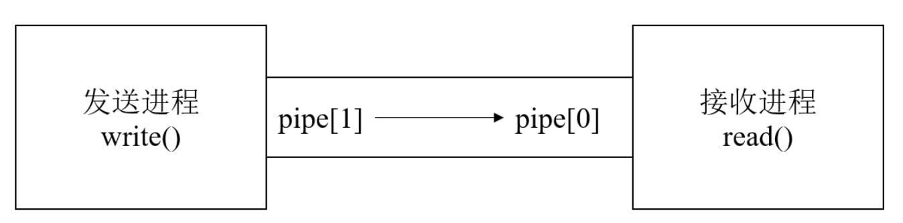
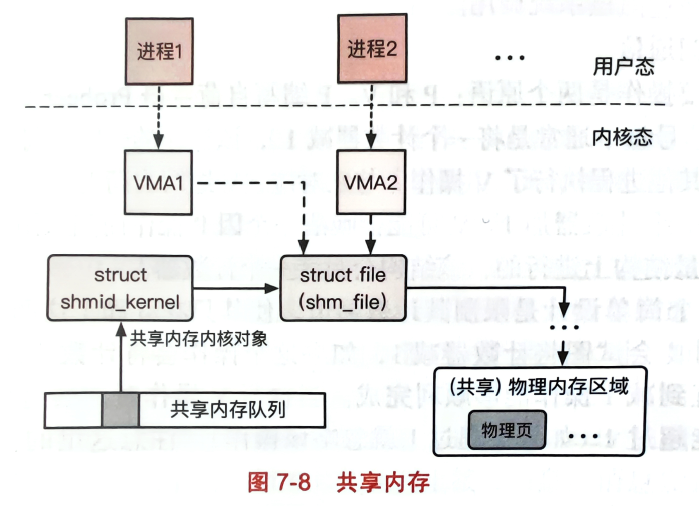

<style>
body {
  position: relative; /* 确保 body 元素的 position 属性为非静态值 */
}

body::before {
  --size: 35px; /* 调整网格单元大小 */
  --line: color-mix(in hsl, canvasText, transparent 60%); /* 调整线条透明度 */
  content: '';
  height: 100vh;
  width: 100%;
  position: absolute; /* 修改为 absolute 以使其随页面滚动 */
  background: linear-gradient(
        90deg,
        var(--line) 1px,
        transparent 1px var(--size)
      )
      50% 50% / var(--size) var(--size),
    linear-gradient(var(--line) 1px, transparent 1px var(--size)) 50% 50% /
      var(--size) var(--size);
  -webkit-mask: linear-gradient(-20deg, transparent 30%, white 80%);
          mask: linear-gradient(-20deg, transparent 30%, white 80%);
  top: 0;
  transform-style: flat;
  pointer-events: none;
  z-index: -1;
}

@media (max-width: 768px) {
  body::before {
    display: none; /* 在手机端隐藏网格效果 */
  }
}
</style>

# 🟤 Process & Thread

## 进程、线程、协程区别与联系？

进程、线程和协程是计算机程序执行的三个不同层次。

### 区别

- **进程(Process)**：  **进程是操作系统进行资源分配和调度的基本单位**，是一个独立运行的程序实体。每个进程拥有独立的内存空间、文件描述符、寄存器状态等资源。进程之间的资源是相互隔离的，因此 **进程间通信需要通过操作系统提供的特定机制(如管道、消息队列、共享内存等)** 进行。由于进程拥有独立的资源，所以进程间的切换和调度开销较大
- **线程(Thread)**：  **线程是操作系统调度执行的最小单位**，是进程内的一个执行流。一个进程可以拥有多个线程，这些 **线程共享进程的资源(如内存空间、文件描述符等)**。由于线程共享相同的资源，线程间通信相对简单，可以直接通过共享变量、锁等方式进行。线程相较于进程， **上下文切换和调度开销较小**。但多个线程并发执行时，需要处理好同步和互斥问题，以避免数据不一致或竞争条件
- **协程(Coroutine)**： 协程是一种用户态的轻量级线程，它的 **调度和切换完全由程序控制**，不依赖于操作系统的调度。协程之间共享线程的资源，因此协程间通信也可以通过共享变量、锁等方式进行。协程的优势在于能够 **轻松地实现高并发**，因为协程切换和调度的开销非常小。协程适用于 I/O 密集型任务，通过异步 I/O 可以有效地提高程序的性能

### 联系

- **线程属于进程**，多个线程共享进程的资源。一个进程可以包含多个线程，这些线程共同完成任务，提高程序的并发性
- **协程属于线程**，多个协程共享线程的资源。一个线程可以包含多个协程，这些协程协同完成任务，提高程序的性能
- 进程、线程和协程在执行程序时，都需要面对同步、互斥和通信等问题。在实际应用中，可以根据需求和场景选择合适的执行实体来实现最优的性能和资源利用

## 讲一讲用户线程与内核线程？

### 用户线程

**用户线程是完全在用户空间中实现和管理的线程**。它们的 **创建、同步和调度都由用户级别的线程库(如 POSIX 线程库，即 Pthreads)处理**，而不需要内核直接参与。由于用户线程的操作不涉及系统调用，它们的创建和切换开销相对较小。用户线程的一个主要限制是，它们 **不能充分利用多核处理器的并行能力**。因为操作系统调度的基本单位是内核线程， **当一个用户线程阻塞时(如 I/O 操作)，整个进程都会被阻塞**，即使其他用户线程仍处于就绪状态。这可能导致多处理器系统中的性能下降。

### 内核线程

**内核线程是由操作系统内核直接支持和管理的线程**。内核负责创建、调度和销毁内核线程，每个内核线程都拥有独立的内核栈和线程上下文。由于内核线程是操作系统调度的基本单位，它们 **可以充分利用多处理器系统的并行能力**。内核线程的缺点是，它们的 **创建、切换和同步操作涉及系统调用，导致较大的开销**。此外，内核线程需要更多的内核资源(如内核栈)，这可能在 **大量线程的情况下导致资源耗尽。** 

### 总结

用户线程和内核线程分别 **代表了两种线程实现方式**，用户线程的开销较小，但在多处理器系统中可能无法充分利用并行能力；内核线程可以充分利用多处理器的并行能力，但开销较大。在实际应用中，可以根据具体需求和性能要求选择合适的线程类型。有些操作系统(如 Linux、Windows)采用了一种混合模型，将用户线程和内核线程结合起来。在这种模型中，每个用户线程都映射到一个内核线程上，这样可以同时利用用户线程的轻量级特性和内核线程的并行能力。

## 一个进程最多可以创建多少个线程？

一个进程最多可以创建的线程数受到两个主要因素的影响：**进程的虚拟内存空间上限** 和 **系统参数限制**。

### 32 位系统

在 32 位 Linux 系统中，虚拟地址空间是 4G，内核空间占用 1G，位于最高处，剩下的 3G 是用户空间。

每个线程需要分配一个栈空间，默认栈空间大小是 8M（可以通过 `ulimit -s` 查看）。假设创建一个线程需要占用 10M 虚拟内存，总共有 3G 虚拟内存可以使用，那么最多可以创建差不多 300 个（3G/10M）左右的线程。

如果想创建更多线程，可以调整创建线程时分配的栈空间大小，比如调整为 512k：`ulimit -s 512`

### 64 位系统

64 位系统的用户空间虚拟内存最大值是 128T，这个数值很大。如果按创建一个线程需要占用 10M 栈空间的情况来算，理论上可以创建 128T/10M 个线程，也就是 1000 多万个线程。

但实际上肯定创建不了那么多线程，除了虚拟内存的限制，还有系统的限制。下面这三个内核参数的大小，都会影响创建线程的上限：

- `/proc/sys/kernel/threads-max`：表示系统支持的最大线程数，默认值是 `14553`
- `/proc/sys/kernel/pid_max`：表示系统全局的 PID 号数值的限制，每一个进程或线程都有 ID，ID 的值超过这个数，进程或线程就会创建失败，默认值是 `32768`
- `/proc/sys/vm/max_map_count`：表示限制一个进程可以拥有的 VMA(虚拟内存区域) 的数量，如果它的值很小，也会导致创建线程失败，默认值是 `65530`

因此，一个进程最多可以创建的线程数受到虚拟内存空间上限和系统参数限制的共同影响。

## 进程的调度算法？

调度器主要考虑两个问题，需要调度哪个任务；每个任务执行多长时间。对于现代操作系统来说，需要着重考虑的一点是如何调度让每个任务从用户的眼中是在同时进行的。之后才会考虑如何调度让性能最佳。

### 时间片轮转(RR)

- 用户体验最直接的指标就是 **响应时间**，现代的操作系统调度一般都是采用时间片轮转的思路，也就是将 CPU 划分为一个一个时间片， **每个任务独占 CPU 的一个时间片**，如果时间片设置的足够小，那么每个任务都会在一定的时间内执行并响应用户；对于 RR 策略来说，时间片大小的选取是需要考虑的问题， **时间片选的越小，那么任务响应的时间就越快，但是这意味着调度的次数会增加，调度的开销就大** 
- 这个策略的 **弊端是任务的平均周转时间比较高**，因为所有任务是平分 CPU 资源的，从这个角度来说 RR 策略 **保证了任务的公平性，但是公平必然会损失性能** 

### 优先级调度

- 优先级调度是在 RR 的时间片轮转基础上，满足用户的响应时间指标后考虑系统性能的。首先为了给用户提供更好的体验， **交互式任务的优先级一定高于批处理任务**。然后对于有明确截止时间的任务，应该设置最高的优先级。因此优先级的顺序从高到低应该是： **明确截止时间的任务 > 交互式任务 > IO 密集型任务 > 批处理任务** 
- 优先级思想最早体现在早期的批处理任务的策略：主要有三个：先到先得(FCFS)，最短任务优先(SJF)，最短完成时间优先(STCF)，这三个策略都是考虑批处理任务，主要考虑的是平均周转时间而不考虑任务响应时间

### 先到先得(FCFS)

- 先到先得策略就是谁先来就调度谁，就是个先来后到的策略。它考虑的优先级是：任务到达时间早的优先级高。这个策略最大的特点就是简单直观，开发者只用维护一个队列即可。这个策略属于非抢占式调度，在任务执行完前是不会让出 CPU 的
- 这个策略的问题在于 **对短任务不友好**，假设前面排着一个长任务，那么这个短任务要等很久，本来它只用很短的时间就执行完了，但现在它的周转时间会变得很长；同样 **对 IO 密集型也不友好**，当 IO 密集型需要读写 IO 而进入阻塞让出 CPU 时，假设后序是一个长时间运行的任务，那么当 IO 读写完了也需要等待很长时间；而且它根本就没有考虑响应时间， **对交互式任务很不友好** 


### 最短任务优先(SJF)

- 这个策略是最短的任务先执行，也就是考虑执行时间最短的任务优先级高；它的任务平均周转时间肯定要比 FCFS 要短，但是它也存在一些问题，首先它 **必须预知任务运行的时间**，这个就很难办；其次它的表现 **严重依赖于任务到达时间点**，如果一个运行时间比前一个短的稍微来晚点，也得等前一个运行完了才能继续，所以并没有真正的最短任务优先，是在 FCFS 的基础上的最短任务优先。与 FCFS 一样，都是非抢占式调度


### 最短完成时间优先(STCF)

- 之前的最短任务优先并不是真正的最短任务优先，迟到了的任务是无法受益的，因此可以按照最短完成时间来调度，也就是任务剩余时间短的优先级高；谁完成时间最短，谁就直接把前面的 CPU 抢占了；这个策略不同于之前的必须执行完才是下一个， **属于抢占式调度**，这个策略较好的考虑的短任务，它的平均周转时间是比较小的，但是这个策略的问题在于 **长任务的饥饿问题**，也就是说如果短任务多了，那么长任务需要一直等待。

### 多级队列(MLQ)

- 早期批处理任务调度策略都是隐式的优先级，并没有直接指出优先级，多级队列是明确的指出的优先级，每个任务的优先级设定好了就不会变动，它属于 **静态的优先级调度策略** 
- MLQ 即每个不同的优先级设置一个队列，优先处理高优先级的任务， **相同优先级之间采用时间片轮转的策略保证响应时间**。MLQ 适合于静态的应用场景，这类场景下任务信息可以再执行前获得，基于此可以分配不同的优先级来实现调度
- MLQ 是一种高效的优先级调度策略，但是从另一个角度说，它 **依然没有解决低优先级的饥饿问题**。如果高优先级的任务数量很多，那么低优先级永远也不会去执行
- 同时 **优先级固定也会带来一个叫做优先级反转的问题**，比如有任务 A, B, C，优先级依次从高到低，然后此时 C 恰好持有一把锁，A 也想获得这把锁，但是因为 C 先拿走了，所以 A 此时只能进入阻塞状态等 C 放锁；然后因为 B 比 C 优先级高，所以 B 先运行，那么此时就有 B 比 A 优先级高的一个假象。一般来说解决这类问题的思路是优先级继承，也就是 A 暂时把它的优先级转移给 C，让 C 先完成，这样 A 就能接着完成

### 多级反馈队列(MLFQ)

- 多级队列是一种较好的考虑优先级的策略，但是它没有解决低优先级的饥饿问题，而且多级队列需要提前预判各个任务的优先级，但随着任务不断复杂，预测任务变得比较困难。因此静态的策略已经不能满足需要，需要 **动态的调整优先级**，这也就是多级反馈队列。多级反馈队列的最大特点是实现了优先级的动态设置
- 具体的策略是，短任务具有更高的优先级，这样主要是为了降低平均周转时间；I/O 密集型的任务因为其 CPU 运行时间比较短，所以它的优先级一般也比较高，有利于提高 IO 资源的利用率；交互式任务一般是短任务，所以其优先级一般也比较高
- 在真实系统中，可能无法去预测是短任务还是长任务，因此需要动态的去调整，当任务第一次进入运行队列时，系统会假定该任务是最高优先级，如果该任务运行时间超过最大运行时间，那么系统自动会给其降低优先级
- 为了缓解低优先级的饥饿问题，调度器会定时的将所有低优先级的队列重新提到最高。保证低优先级有机会执行

### 完全公平调度(CFS)

- 优先选择 vruntime 少的任务，以保证每个任务的公平性
- 虚拟运行时间 vruntime += 实际运行时间 delta_exec* NICE_0_LOAD/ 权重
- 运行队列用 **红黑树** 来描述的，按 vruntime 大小来排序的，最左侧的叶子节点就是下次会被调度的任务

## 进程间通信方式？

 **进程间通信(Inter-Process Communication, IPC)是指进程之间通过特定的方式共享数据和信息的过程**。在多任务操作系统中进程间通信对于协调进程的执行和实现资源共享非常重要。以下是一些常见的进程间通信方式：

### 管道



- 管道是一种 **单向的 IPC**，内核中存在一定缓冲区，并且传输的数据是字节流。管道在 Unix 中是被当做一个文件，系统调用会提供两个文件描述符供用户读写文件
- 如果管道的写端没有被进程持有，而收端尝试去读的话，此时会受到 EOF，如果写端有进程持有的话，读端就会阻塞在 read 上
- 管道分为命名管道与匿名管道， **匿名管道没有名字，是通过系统调用 pipe() 创建的，只返回两个文件描述符**，注意是 pipe[1] 写给 pipe[0]。因为匿名管道没有名字，所以一般匿名管道只能用于两个关系比较近的进程，比如 fork 出来的父子进程
- 当 **两个关系比较远的时候，此时就应该使用命名管道**，创建该管道的命令为 mkfifo，需要指定一个全局的文件名与权限，之后读写管道就是在读写这个文件
- 管道只能单项传输数据， **如果想双向传输，那么就用 socketpair**。socketpair 会创建两个 socket，父进程关闭一个，子进程关掉另一个。这样双方各拿一个 socket 通信

### 消息队列

- 消息队列是 **唯一一个以消息为数据抽象的通信方式**。消息队列在内核中的数据结构是一个 **单链表构成的队列**，最初会有个消息头部指针，保存着消息队首与相应的权限；每个消息都会有下一个消息的指针，以及消息本身的内容
- 消息队列的 **内存空间有限**，一般来说 **传递长消息时采用共享内存的方式**，而非消息队列。通过消息队列传递数据需要先 copy 到内核，然后再到收端，所以有个代价

### 共享内存



- 使用共享内存很重要的一个原因是 **共享内存不需要先拷贝到内核空间中，速度比较快**。共享内存的核心思路就是允许一个或者多个进程所在的虚拟地址空间中映射相同的物理页，从而进行通信
- 共享内存的实现机制：首先内核会给全局的共享内存 **维护一个全局的队列结构**，这个队列的 **每一项是一个 shmid_kernel 结构体与一个 IPC key 来绑定的**，各进程可以通过 key 来找到并使用同一段共享内存；该进程能否操作这段共享内存可以通过 System V 的权限检查机制来判断
- 当两个进程同时对一个共享内存建立了映射后， **内核会给他们分配两个 VMA 结构体，进程可以通过他们各自的虚拟地址来访问 VMA 并访问其背后的共享内存空间** 

### 信号量

- 信号量是用来 **辅助控制多个访问线程访问有限数量资源的** 
- 信号量不同于消息队列这种明确是传递消息的，它主要是用来同步，它就能传递一个整数，一般还是0，1。信号量操作主要有两个原语，P 操作与 V 操作，P 操作就是信号量减 1，如果失败就会阻塞，直到可以减；V 操作就是信号量 +1，V 操作可以唤醒一个因 P 操作阻塞的进程

## 讲一讲进程虚拟化？

进程虚拟化是一种操作系统技术，它 **允许多个进程在同一个计算机上运行**，同时为每个进程提供独立的虚拟地址空间和资源。进程虚拟化的目标是提高资源利用率、隔离进程以保证系统安全性和稳定性，以及简化进程管理和调度。

- **虚拟地址空间**：在进程虚拟化中，每个进程都有自己的虚拟地址空间，与其他进程的地址空间相互独立。虚拟地址空间包含了进程的代码、数据、堆和栈等内存区域。 **虚拟地址空间通过内存管理单元(MMU)映射到物理内存**，实现了虚拟内存的概念。这种映射使得每个进程都认为自己在独占整个地址空间，从而简化了内存管理和保护
- **上下文切换**：在进程虚拟化中，操作系统需要在不同进程之间进行切换，以实现多任务和并发。上下文切换是指保存当前进程的状态(如寄存器、程序计数器、内存映射等)，然后恢复另一个进程的状态，从而实现进程切换。上下文切换可能导致一定的性能开销，因此需要在进程调度和同步中尽量减少不必要的切换
- **进程隔离**：进程虚拟化提供了一定程度的进程隔离，以确保一个进程的错误或恶意行为不会影响其他进程和系统。进程隔离通过虚拟地址空间、内存保护和权限控制等机制实现。例如，一个进程无法直接访问另一个进程的内存，除非通过进程间通信或共享内存的方式。此外，操作系统还可以限制进程对文件、设备和网络等资源的访问
- **进程调度**：在进程虚拟化中，操作系统负责根据优先级、资源需求和策略等因素调度进程的执行。进程调度旨在提高资源利用率、降低响应时间和确保公平性。常见的进程调度算法包括先来先服务(FCFS)、短作业优先(SJF)、优先级调度、时间片轮转(Round Robin)等

## 进程的状态有哪些？

进程的状态是描述进程在生命周期中的各种可能阶段。操作系统根据进程的状态来管理和调度进程。以下是常见的进程状态：

- **新建(New)**：当一个进程刚刚被创建时，它处于新建状态。在这个状态下，操作系统为进程分配必要的资源，如内存、文件描述符等，并初始化进程控制块(PCB)等数据结构
- **就绪(Ready)**：进程已经准备好运行，正在等待操作系统调度器分配 CPU 时间片。就绪状态的进程已分配到了除 CPU 之外的所有必要资源，只需要 CPU 时间片就可以开始执行
- **运行(Running)**：进程正在 CPU 上执行。在任何给定时刻，每个 CPU 或核心上最多只能有一个进程处于运行状态
- **阻塞(Blocked)**：进程因等待某个事件(如 I/O 操作完成、锁释放或信号到达)而暂停执行。在阻塞状态下，进程无法继续执行，直到等待的事件发生
- **终止(Terminated)**：进程已经完成执行或因某种原因被终止。在终止状态下，进程的资源被回收，进程控制块(PCB)可能被保留一段时间以便父进程获取子进程的退出状态

**挂起状态**：在虚拟内存管理的操作系统中，通常会把阻塞状态的进程的物理内存空间换出到硬盘，等需要再次运行的时候，再从硬盘换入到物理内存。挂起状态描述进程没有占用实际的物理内存空间的情况，这与阻塞状态不同，阻塞状态是等待某个事件的返回。挂起状态可以分为两种：
- **阻塞挂起状态**：进程在外存（硬盘）并等待某个事件的出现
- **就绪挂起状态**：进程在外存（硬盘），但只要进入内存，即刻立刻运行

导致进程挂起的原因不只是因为进程所使用的内存空间不在物理内存，还包括通过 sleep 让进程间歇性挂起，或用户希望挂起一个程序的执行（比如在 Linux 中用 `Ctrl+Z` 挂起进程）。

**进程控制块(PCB)**：操作系统用进程控制块(PCB)数据结构来描述进程。PCB 是进程存在的唯一标识，意味着一个进程的存在，必然会有一个 PCB，如果进程消失了，那么 PCB 也会随之消失。PCB 包含以下信息：
- **进程描述信息**：进程标识符、用户标识符
- **进程控制和管理信息**：进程当前状态、进程优先级
- **资源分配清单**：有关内存地址空间或虚拟地址空间的信息，所打开文件的列表和所使用的 I/O 设备信息
- **CPU 相关信息**：CPU 中各个寄存器的值，当进程被切换时，CPU 的状态信息都会被保存在相应的 PCB 中，以便进程重新执行时，能从断点处继续执行

通常 PCB 是通过链表的方式进行组织，把具有相同状态的进程链在一起，组成各种队列（如就绪队列、阻塞队列等）。

进程在其生命周期中可能会在这些状态之间转换。操作系统通过进程调度、资源管理和事件处理等机制来实现状态转换。

## 进程如何创建的？

**进程创建**：操作系统允许一个进程创建另一个进程，而且允许子进程继承父进程所拥有的资源。创建进程的过程如下：
- 申请一个空白的 PCB，并向 PCB 中填写一些控制和管理进程的信息，比如进程的唯一标识等
- 为该进程分配运行时所必需的资源，比如内存资源
- 将 PCB 插入到就绪队列，等待被调度运行

以类 Unix 系统(如 Linux)为例，进程创建的过程如下：

- **调用 fork() 系统调用**：进程创建通常从一个已有的进程(父进程)开始。父进程调用 fork() 系统调用来创建一个新的进程(子进程)。fork() 系统调用会复制父进程的进程控制块(PCB)、虚拟内存布局、文件描述符等数据结构，从而创建一个与父进程几乎完全相同的子进程。 **fork() 调用在父进程中返回子进程的进程 ID，而在子进程中返回 0** 
- **子进程修改内存映射**：在 fork() 之后，子进程通常需要修改其虚拟内存映射，以 **实现写时复制(Copy-on-Write, COW)机制**。写时复制是一种内存优化技术，它允许子进程在创建时共享父进程的内存页面，直到需要修改页面内容时才复制页面。这种机制避免了不必要的内存复制，提高了进程创建的性能
- **调用 exec() 系统调用(可选)**：如果子进程需要执行与父进程不同的程序，可以 **调用 exec() 系统调用来替换当前的程序映像**。 **exec() 系统调用会加载新程序的代码和数据到内存**，然后设置程序计数器(Program Counter)指向新程序的入口点。需要注意的是，exec() 调用会替换子进程的程序映像，但不会影响进程控制块(PCB)、文件描述符等数据结构
- **子进程开始执行**：子进程开始执行新程序或继续执行父进程的代码。通常，子进程会根据 fork() 或 exec() 的返回值来判断自己的角色，并执行相应的逻辑。例如，子进程可能会关闭不需要的文件描述符、初始化资源或启动新的线程等
- **父进程等待子进程(可选)**：父进程可以选择等待子进程的完成，以获取子进程的退出状态和回收资源。 **在类 Unix 系统中，wait() 或 waitpid() 系统调用可以用于等待子进程**。当子进程结束时，操作系统会发送一个 SIGCHLD 信号通知父进程，父进程可以捕获该信号并处理子进程的退出事件

**进程阻塞**：当进程需要等待某一事件完成时，它可以调用阻塞语句把自己阻塞等待。而一旦被阻塞等待，它只能由另一个进程唤醒。阻塞进程的过程如下：
- 找到将要被阻塞进程标识号对应的 PCB
- 如果该进程为运行状态，则保护其现场，将其状态转为阻塞状态，停止运行
- 将该 PCB 插入到阻塞队列中去

**进程唤醒**：进程由「运行」转变为「阻塞」状态是由于进程必须等待某一事件的完成，所以处于阻塞状态的进程是绝对不可能叫醒自己的。如果某进程正在等待 I/O 事件，需由别的进程发消息给它，则只有当该进程所期待的事件出现时，才由发现者进程用唤醒语句叫醒它。唤醒进程的过程如下：
- 在该事件的阻塞队列中找到相应进程的 PCB
- 将其从阻塞队列中移出，并置其状态为就绪状态
- 把该 PCB 插入到就绪队列中，等待调度程序调度

进程的阻塞和唤醒是一对功能相反的语句，如果某个进程调用了阻塞语句，则必有一个与之对应的唤醒语句。

## 如何回收线程？

线程回收是指在一个线程完成执行后，释放其占用的资源并清除相关数据结构的过程。线程回收的方法取决于具体的编程语言和操作系统。以下是几种常见的线程回收方法：

### 使用 join() 方法

在很多编程语言和库中(如 C++11 中的 std::thread、 Python 的 threading  模块等)，线程对象通常提供了一个 join() 方法。通过调用该方法， **主线程(或其他线程)可以等待目标线程完成，并在完成后回收资源**。使用 join() 方法的好处是可以确保目标线程的资源被正确回收，避免内存泄漏和僵尸线程等问题。

```C++
  #include <iostream>
  #include <thread>

  void thread_function() {
      std::cout << "Hello, I am a new thread!" << std::endl;
  }

  int main() {
      std::thread t(thread_function);
      t.join(); // 等待线程 t 完成，并回收资源
      return 0;
  }
```

### 使用线程分离(detach)

在某些情况下可能不需要等待线程完成，而只需确保线程在退出时自动回收资源。这时可以使用线程分离(detach)方法。例如，在 C++11 的 std::thread 中，可以调用 detach() 方法将线程设置为分离状态。 **分离状态的线程在完成执行后会自动释放资源**，无需调用 join() 方法。

```C++
  #include <iostream>
  #include <thread>

  void thread_function() {
      std::cout << "Hello, I am a new thread!" << std::endl;
  }

  int main() {
      std::thread t(thread_function);
      t.detach(); // 将线程 t 设置为分离状态
      return 0;
  }
```

使用 **分离状态的线程可能会导致一定程度的不确定性，因为主线程(或其他线程)无法知道分离线程何时完成**。因此，在使用线程分离时需要确保线程之间的同步和资源管理得当，避免竞态条件和内存泄漏等问题。

### 使用线程局部存储(Thread-Local Storage, TLS)

在某些编程语言和库中，可以使用线程局部存储(TLS)机制为每个线程分配独立的资源，如内存、文件描述符等。 **通过 TLS 可以确保线程在退出时自动回收其占用的资源**，从而简化线程管理和资源回收。需要注意的是，TLS 机制通常需要特定的编程语言或库支持，如 C++11 的 thread_local 关键字、Python 的 threading.local() 函数等。以下是使用线程局部存储的示例：

```C++
  #include <iostream>
  #include <thread>
  #include <mutex>

  thread_local int thread_local_variable; // 声明一个线程局部变量

  void thread_function(int value) {
      thread_local_variable = value;
      std::cout << "Thread local variable: " << thread_local_variable << std::endl;
  }

  int main() {
      std::thread t1(thread_function, 10);
      std::thread t2(thread_function, 20);

      t1.join();
      t2.join();

      return 0;
  }
```

## 进程终止方式？

进程终止是指一个进程完成其生命周期并释放其占用的资源的过程。操作系统和编程语言通常提供多种进程终止方式，以适应不同的场景和需求。以下是一些常见的进程终止方式：

- **正常终止(Normal Termination)**：正常终止是指进程自然完成其执行任务并主动退出的情况。在这种情况下，进程通常会返回一个退出状态码(Exit Code)，以表示执行结果。例如，在 C 和 C++ 程序中，main() 函数的返回值会作为进程的退出状态码
- **异常终止(Abnormal Termination)**：异常终止是指进程因某种错误或异常而被迫退出的情况。例如，进程遇到段错误(Segmentation Fault)、浮点异常(Floating Point Exception)或其他未捕获的异常时，操作系统通常会终止进程并生成一个核心转储文件(Core Dump)。异常终止通常表示进程存在 bug 或资源问题，需要进行调试和修复
- **通过信号(Signal)终止**：操作系统使用信号(Signal)机制来向进程发送事件和命令。部分信号可导致进程终止，如 SIGTERM、SIGINT、SIGKILL 等。例如，当用户按下 Ctrl+C 时，操作系统会向前台进程发送一个 SIGINT 信号，请求进程终止。进程可以捕获和处理部分信号(如 SIGTERM、SIGINT)，以实现优雅退出或其他自定义行为。然而，某些信号(如 SIGKILL)无法被捕获，会强制终止进程
- **通过系统调用(System Call)终止**：操作系统通常提供一些系统调用来实现进程管理和控制。例如，在类 Unix 系统中， **进程可以调用 exit()、_exit() 或 abort() 等系统调用来主动终止自己**。这些系统调用会通知操作系统回收进程的资源，如内存、文件描述符等，并将进程状态设置为终止(Terminated)
- **父进程终止子进程**：父进程可以通过特定的系统调用或信号来终止其子进程。例如，在类 Unix 系统中，父进程可以调用 kill() 系统调用来向子进程发送 SIGTERM、SIGINT、SIGKILL 等信号，请求子进程终止。此外，父进程还可以使用 wait() 或 waitpid () 系统调用来等待子进程的完成，并在完成后回收资源

## 如何让进程后台运行？

在 Unix/Linux shell 中，可以通过在命令后 **添加 & 符号将进程放入后台运行**。这样，进程将在后台执行，而不会阻塞 shell。例如：

```bash
./your_program &
```
在 Unix/Linux 系统中，可以使用 nohup 命令在后台运行进程，并使其在终端关闭后仍然继续运行。nohup 命令会忽略 SIGHUP 信号，使进程在终端关闭后不会被终止。例如：
```bash
nohup ./your_program &
```
这将把程序输出重定向到名为 nohup.out 的文件中，或者你可以手动重定向输出到其他文件：
```bash
nohup ./your_program > output.log 2>&1 &
```
screen 和 tmux 是两个流行的终端复用器，它们允许你在后台运行多个会话，并在需要时重新连接。这些工具非常适合在远程服务器上运行持久的进程。例如，使用 screen：
```bash
screen ./your_program
```
使用  **tmux**  的方法如下：
```bash
tmux 
./your_program
```

在 Windows 系统中，可以使用任务计划程序在后台运行进程。任务计划程序允许你创建和管理计划任务，如定时运行程序、执行脚本等。

## 讲一讲守护进程，僵尸进程，孤儿进程？

### 守护进程

守护进程是一种在后台运行的特殊进程，通常用于提供某种服务或执行定期任务。 **守护进程没有控制终端(Controlling Terminal)，因此不会与用户交互**。它们通常在系统启动时启动，并在系统关闭时终止。守护进程的名称通常以 d 结尾，如 sshd(Secure Shell Daemon)、httpd(HTTP Daemon)等。要创建守护进程，通常需要执行以下操作：

- 调用 fork() 产生子进程，然后让父进程退出。这样子进程会成为孤儿进程， **被 init 进程(进程 ID 为 1)收养**，从而摆脱原始的控制终端
- 调用 setsid() 创建新的会话(Session)并成为会话组长，以确保进程不再拥有控制终端
- 改变当前工作目录(例如，切换到根目录)
- 重设文件权限掩码(umask)
- 关闭不需要的文件描述符
- 处理相关信号(如 SIGHUP、SIGTERM 等)

### 僵尸进程

 **僵尸进程是一种已经终止但仍占用进程表(Process Table)空间的进程**。当一个进程终止时，其子进程的状态会变为僵尸进程，直到父进程通过调用 wait() 或 waitpid() 系统调用回收其资源。僵尸进程不再占用 CPU 或内存资源，但会占用进程表空间。如果系统产生大量僵尸进程，可能导致进程表耗尽，从而影响系统性能。为避免僵尸进程，父进程应当及时回收已终止子进程的资源。

### 孤儿进程

 **孤儿进程是指父进程在子进程之前终止，导致子进程失去父进程的情况**。在 Unix 和类 Unix 系统中， **孤儿进程会被 init 进程(进程 ID 为 1)收养**。init 进程会定期调用 wait() 或 waitpid() 系统调用，以回收孤儿进程的资源。因此，孤儿进程不会成为僵尸进程。虽然孤儿进程可能会在一段时间内无人管理，但它们最终会被 init 进程收养并得到妥善处理。孤儿进程仍然可以独立运行，完成其任务，直到它们自然结束或被操作系统终止。

### 总结

- **守护进程**：后台运行的特殊进程，用于提供服务或执行定期任务，没有控制终端
- **僵尸进程**：已经终止但仍占用进程表空间的进程，需要父进程调用 wait() 或 waitpid() 回收资源
- **孤儿进程**：父进程在子进程之前终止的进程，会被 init 进程收养并最终得到妥善处理

## 讲一讲父进程，子进程，进程组，会话？

### 父进程(Parent Process)和子进程(Child Process)

在操作系统中，进程可以创建其他进程。创建新进程的进程称为父进程，新创建的进程称为子进程。这种关系形成了一个进程树结构，其中根进程(如 Unix 和类 Unix 系统中的 init 进程，进程 ID 为 1)是所有其他进程的祖先。在 Unix 和类 Unix 系统中，可以通过 fork() 系统调用创建子进程。fork() 调用会复制当前进程的地址空间和环境，并创建一个新的进程。 **子进程从 fork() 调用处继续执行，并继承父进程的大部分属性(如文件描述符、环境变量等)**。父子进程可以通过 getpid()(获取当前进程 ID)和 getppid()(获取父进程 ID)系统调用来识别彼此。

### 进程组(Process Group)

 **进程组是一个或多个进程的集合，它们共享相同的进程组 ID(Process Group ID，简称 PGID)**。进程组用于组织具有相关任务的进程，并允许向整个进程组发送信号。进程组 ID 通常由进程组中的第一个进程(组长)的进程 ID 决定。进程可以调用 setpgid() 系统调用加入一个现有的进程组，或创建一个新的进程组。

### 会话(Session)

 **会话是一个或多个进程组的集合，它们共享相同的会话 ID(Session ID，简称 SID)**。会话用于管理终端和登录环境下的进程。每个会话都有一个单独的控制终端(Controlling Terminal)，该终端可以发送信号给会话中的所有进程。会话 ID 通常由会话中的第一个进程(会话组长)的进程 ID 决定。进程可以调用 setsid() 系统调用创建一个新的会话，并成为该会话的组长。

### 总结

- **父进程和子进程**：进程可以创建其他进程，形成父子关系。这种关系构成了进程树结构
- **进程组**：一个或多个具有相同进程组 ID 的进程的集合，用于组织相关任务的进程
- **会话**：一个或多个具有相同会话 ID 的进程组的集合，用于管理终端和登录环境下的进程

## 多进程与多线程怎么选择？

### 应用场景

- **多进程**：如果应用需要独立的地址空间和资源，或者需要在不同的安全上下文中运行，那么多进程可能是更好的选择
- **多线程**：如果应用需要高度共享数据和资源，或者需要轻量级的任务并发，那么多线程可能更适合

### 资源需求

- **多进程**：每个进程都有独立的地址空间，因此资源占用(如内存)可能会更高。在资源受限的环境下，多进程可能不是最佳选择
- **多线程**：线程共享进程的地址空间和资源，因此资源占用较低。对于资源受限的环境，多线程可能更合适

### 开发和维护难度

- **多进程**：进程间通信(IPC)可能相对复杂，需要使用诸如管道、共享内存、信号量等机制。此外，进程的创建和管理相对较重，可能会增加开发和维护难度
- **多线程**：线程间通信较为简单，因为它们共享地址空间。然而，多线程编程可能涉及复杂的同步和锁定机制，以避免数据竞争和死锁等问题

### 可扩展性

- **多进程**：多进程可以更好地利用多核处理器和分布式系统。在这些情况下，多进程可能具有更好的可扩展性
- **多线程**：多线程在单核处理器上可能表现得更好，因为它们共享资源并减少了上下文切换的开销。然而，在多核处理器上，多线程可能受到全局锁和资源争用的影响

### 容错性和隔离

- **多进程**：由于每个进程都有独立的地址空间，因此一个进程的崩溃不太可能影响其他进程。这有助于提高系统的容错性和隔离性
- **多线程**：一个线程的崩溃可能导致整个进程崩溃，从而影响其他线程。在需要高度隔离和容错性的场景中，多线程可能不是最佳选择

## 什么情况下，进程会进行切换？

进程切换，也称为上下文切换(context switch)，是操作系统在多个进程之间进行调度的过程。进程切换通常发生在以下情况：

- **时间片到期**：大多数操作系统使用基于时间片(time slice)的抢占式调度算法。每个进程会被分配一个固定长度的时间片来执行。当进程的时间片用完时，操作系统会将当前进程挂起，并选择另一个进程继续执行。
- **高优先级进程就绪**：当一个高优先级的进程变为就绪状态时(例如，从阻塞状态恢复)，操作系统可能会中断当前正在运行的低优先级进程，转而执行高优先级进程。
- **进程自愿让出 CPU**：有时，进程会主动放弃其剩余时间片，以便其他进程可以执行。这通常发生在进程等待某个事件(如 I/O 操作、锁释放等)时。
- **进程阻塞**：当进程需要等待某个资源(如 I/O 操作完成、信号量、互斥锁等)，它会进入阻塞状态。在这种情况下，操作系统会选择另一个就绪进程执行。
- **中断处理**：当 CPU 收到中断信号时(如硬件中断、异常等)，当前正在执行的进程可能会被暂停，以便操作系统处理中断。处理完成后，操作系统可以选择恢复中断前的进程或切换到另一个进程。

**进程上下文切换的过程**：各个进程之间是共享 CPU 资源的，在不同的时候进程之间需要切换，让不同的进程可以在 CPU 执行，那么一个进程切换到另一个进程运行，称为进程的上下文切换。在进行进程切换时，操作系统需要保存当前进程的上下文(如寄存器状态、程序计数器、内存映射等)，然后恢复另一个进程的状态，从而实现进程切换。上下文切换的过程主要包括：
- **保存当前进程的上下文**：操作系统需要保存当前进程的 CPU 寄存器状态、程序计数器(PC)、栈指针等上下文信息到该进程的 PCB 中
- **选择下一个进程**：操作系统根据调度算法从就绪队列中选择下一个要执行的进程
- **恢复下一个进程的上下文**：操作系统从下一个进程的 PCB 中恢复其 CPU 寄存器状态、程序计数器、栈指针等上下文信息
- **切换到下一个进程**：操作系统将 CPU 控制权交给下一个进程，使其开始执行

上下文切换可能导致一定的性能开销，因为需要保存和恢复大量的状态信息，还可能涉及 CPU 缓存的失效和重新加载，因此需要在进程调度和同步中尽量减少不必要的切换。

## 进程通信中的管道实现原理是什么？

管道(pipe)是 Unix 和类 Unix 操作系统中一种简单的进程间通信(IPC)机制。管道允许两个进程通过一个共享的双向或单向数据通道进行通信。管道的实现原理如下：

- **创建管道**：当一个进程需要与另一个进程通信时，它首先通过调 **用 pipe() 系统函数创建一个管道**。该函数会返回一个包含两个文件描述符(file descriptor)的整数数组。这两个文件描述符分别表示管道的读端和写端。管道内部 **使用内核缓冲区(kernel buffer)作为数据传输的临时存储**，这意味着管道的数据传输不需要额外的用户空间内存
- **建立进程间关系**：管道通常与 fork() 系统调用一起使用。父进程在创建管道后调用 fork() 创建子进程。子进程会继承父进程的文件描述符，这样父子进程就可以通过管道进行通信。通常，父进程负责管道的写端，子进程负责读端，或者反过来。为了确保通信的单向性，每个进程在使用前应关闭管道的另一端
- **读写数据**：进程 **可以使用普通的文件 I/O 函数(如 read() 和 write())来读取和写入管道**。当一个进程向管道写入数据时，数据会被存储在内核缓冲区。另一个进程可以从管道的另一端读取数据。如果缓冲区为空，读取操作会阻塞，直到有数据可读。类似地，如果缓冲区已满，写入操作会阻塞，直到有足够的空间
- **关闭管道**：当进程完成通信后，它们应关闭管道的文件描述符。当管道的写端被关闭时，任何尝试从读端读取数据的进程将读取到 EOF(表示数据已经全部读完)。当管道的读端被关闭时，任何尝试向写端写入数据的进程将收到 SIGPIPE 信号，表示管道已断开

管道是一种基于内核缓冲区的简单进程间通信机制。通过创建管道并使用文件描述符进行读写操作，进程可以在不需要额外用户空间内存的情况下进行通信。管道通常与 fork() 系统调用一起使用，以便父子进程可以通过共享文件描述符进行通信。

## 线程崩溃了，进程也会崩溃吗？

一般来说，如果线程是因为非法访问内存引起的崩溃，那么进程肯定会崩溃。

为什么系统要让进程崩溃呢？这主要是因为在进程中，**各个线程的地址空间是共享的**，既然是共享，那么某个线程对地址的非法访问就会导致内存的不确定性，进而可能会影响到其他线程，这种操作是危险的，操作系统会认为这很可能导致一系列严重的后果，于是干脆让整个进程崩溃。

### 非法访问内存的情况

线程共享代码段、数据段、地址空间、文件。非法访问内存有以下几种情况：

1. **针对只读内存写入数据**：比如向只读字符串常量写入数据
2. **访问了进程没有权限访问的地址空间**：比如访问内核空间
3. **访问了不存在的内存**：比如空指针解引用

以上错误都是访问内存时的错误，所以统一会报 Segment Fault 错误（即段错误），这些都会导致进程崩溃。

### 进程是如何崩溃的？

线程崩溃后，进程是如何崩溃的呢？答案是**信号**。当发生非法内存访问时，操作系统会发送信号给进程，进程收到信号后，如果没有注册信号处理函数，进程就会崩溃。

### C/C++ 和 Java 的区别

在 C/C++ 语言中，线程崩溃后，进程也会崩溃。但在 Java 语言中，线程崩溃不会导致 JVM 进程崩溃。这是因为 JVM 注册了信号处理函数，当线程崩溃时，JVM 会捕获信号并处理，而不是让进程崩溃。

## 为什么进程切换慢，线程切换快？

进程切换与线程切换之间的性能差异主要归因于它们在上下文切换过程中涉及的资源和状态的不同。以下是进程切换相对于线程切换更慢的原因：

- **上下文切换的范围**：在进行进程切换时，操作系统需要保存和恢复更多的上下文信息，如寄存器状态、内存管理信息(例如页表)等。而线程切换仅需要保存和恢复线程特有的上下文信息，如寄存器状态、栈指针和程序计数器等。因为线程共享进程的地址空间和其他资源，所以操作系统不需要保存和恢复这些资源的状态
- **缓存效应**：由于 **线程共享进程的地址空间和资源，线程切换时 CPU 缓存(例如 TLB、L1、L2 缓存)的命中率可能更高**。而进程切换时，由于地址空间和资源的变化，CPU 缓存可能需要重新填充，导致性能损失
- **资源同步**：进程切换可能涉及更复杂的资源同步操作，如内存管理、文件描述符等。而线程切换由于共享资源，通常不需要进行这些同步操作

线程切换通常比进程切换快，但并不意味着线程在所有场景下都是最佳选择，在某些情况下，使用进程可能更合适，例如，当需要隔离地址空间或资源时，或者当应用程序需要利用多核处理器或分布式系统的能力时。
